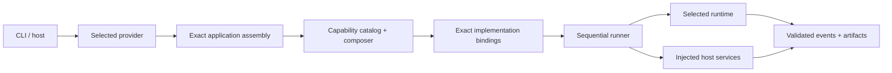

<p align="right"><strong>English</strong> | <a href="README.zh-CN.md">简体中文</a></p>

# Asterion

**A composable, multi-runtime agent application framework.**

Asterion turns agent capabilities into exact, executable applications without giving models ownership of credentials, authority, or infrastructure. It provides versioned contracts for capabilities and runtimes, deterministic application assembly, controlled execution, and evidence that can be inspected independently of model output.

The repository contains the authoritative Python framework in `src/asterion/`, shared TypeScript contracts and Node integration, a Rust controlled executor, built-in application providers, schemas, conformance fixtures, and operator documentation.

## Why Asterion

Agent applications need more than a prompt and a tool loop. Their behavior depends on which capability implementation was selected, which runtime executed it, which host services were authorized, and what evidence survived the run. Asterion makes those decisions explicit:

- **Composable capabilities** — applications are assembled from exact, versioned packages rather than hidden source discovery.
- **Multiple runtimes** — application contracts stay stable while Pi, Claude Code, or application-owned runtimes translate native events into one public protocol.
- **Deterministic assembly** — missing edges, duplicate identities, ambiguous implementations, and dependency cycles fail closed before execution.
- **Host-owned authority** — credentials, execution policy, datasets, cancellation, and provider configuration remain outside portable manifests and are injected explicitly.
- **Verifiable operation** — validated event streams, immutable artifacts, receipts, sealed traces, and replay checks separate environment facts from model claims.

## Architecture



The dependency direction is deliberate:

```text
CLI / host → selected provider → assembly → catalog / composer
           → exact implementations → runner → runtime / host services
```

Framework modules under `runtime/`, `packages/`, `assembly/`, `runner/`, and `services/` remain domain-neutral. Products and applications depend on the framework; generic framework code does not import DCI, ARC-AGI-3, tests, or adjacent source trees.

Language ownership is equally explicit: **Python** owns orchestration, composition, assembly, and execution flow; **TypeScript** validates shared contracts and Node integration; **Rust** owns controlled command execution. The Rust executor applies trusted policy, direct invocation, cleared environments, deadlines, output limits, and cancellation—it is not an operating-system sandbox.

## Core building blocks

| Building block | Responsibility |
|---|---|
| Runtime Protocol | One run identity, contiguous events, matched tool calls/results, cancellation, and exactly one terminal event |
| Capability package | Versioned behavior, compatibility edges, declared artifacts, policies, and exact implementation bindings |
| Application assembly | Exact capability references, runtime compatibility, and required host-service edges |
| Provider | Publishes installed applications and loads only the entry point selected by exact identity |
| Composer | Resolves a deterministic execution plan and rejects ambiguity, missing dependencies, or cycles |
| Runner | Executes the resolved plan sequentially; it does not discover, authorize, retry, persist, schedule, or select runtimes |
| Host service | Injects narrow operator-owned facilities only after host preflight |
| Evidence | Public-safe events, immutable artifacts, receipts, digests, sealed traces, and replay verification |

The closed v1 contracts are:

- `asterion.agent-runtime/v1`
- `asterion.capability/v1`
- `asterion.capability-package/v1`
- `asterion.application-assembly/v1`

Their JSON schemas, Python validators, TypeScript validators, and conformance fixtures must agree. Manifests describe compatibility, not authority: they never contain prompts, credentials, commands, executable paths, environment values, provider configuration, or mutable state.

## Agent implementations

| Implementation | Current role |
|---|---|
| **Asterion Prime** (`asterion.prime`) | Source-independent Prime-style agent implementation over Asterion's Pi transport, persistent programmatic state, bounded execution, and evidence capture |
| **Asterion Native** (`asterion.native`) | Peer native control-plane implementation sharing the same Asterion framework contracts; currently a control provider, not an `AgentRuntime` adapter |

P1 through P7 are applications built on Asterion Prime capabilities. They are not the implementation of the Prime foundation itself. Native Asterion Prime does not import, load, launch, inspect, or require prime-agent source or SDK code.

## Applications

Asterion is a framework; concrete behavior lives in applications assembled from its capabilities.

| Application surface | What it exercises |
|---|---|
| P1–P6 | Persistent IPython work, programmatic long context, recursive workflow, inference scaling, continual execution, and related Prime-style application patterns |
| P7 / ARC-AGI-3 | Stateful visual interaction, online experiments, bounded actions, environment feedback, and replayable solve evidence |
| DCI | A complete reference product for research, evaluation, benchmarking, analysis, and export |
| Controlled code | Capability composition and execution through explicitly injected controlled host services |

### ARC-AGI-3 interactive reasoning

On 9 September 2026, Asterion Prime completed **Level 1 of game `ls20-9607627b`** in one sealed run using Pi and `deepseek-v4-flash`. This demonstrates one Asterion application; it is not a claim that the complete ARC-AGI-3 benchmark was solved or that another agent was matched.

<p align="center">
  
</p>

| Actions | Frames | Reasoning cells | Partial score | Result | Evidence |
|---:|---:|---:|---:|---|---|
| 23 | 30 | 43 | `3.267621` | 1 level completed | sealed trace; replay verified |

ARC-AGI-3 hides the objective and object semantics inside a stateful environment. The agent must learn through small falsifiable actions, retain what changed, revise contradicted hypotheses, and make the environment report success. In this level, controlled experiments revealed fixed two-state row and column bands; comparison and reversible probes isolated the remaining mismatches before completion. Token usage and elapsed time were not recorded by this early run and are not estimated.

`Asterion Prime → Pi → model → persistent IPython → ARC broker → environment → sealed trace → replay verification`

<p align="center">
  
</p>

The report keeps normalized facts, versioned post-run analysis, versioned rendering, and standalone export separate. Its narration cites stored action/frame evidence; it is not hidden chain-of-thought. A retained sealed run can be rebuilt and exported as one distributable HTML file:

```bash
uv run asterion arc-story compile /absolute/path/to/sealed-run
uv run asterion arc-story analyze GAME_ID RUN_ID
uv run asterion arc-story render GAME_ID RUN_ID --analysis ANALYSIS_ID
uv run asterion arc-story export GAME_ID RUN_ID --render RENDER_ID
uv run asterion arc-story serve
```

`analyze` is the model-backed stage; compile, render, export, and serving operate on retained evidence. Local research artifacts use the stable `artifacts/arc-agi-3/` hierarchy and remain outside the package distribution.

## Install and inspect

Python 3.10 or newer and [`uv`](https://docs.astral.sh/uv/) are required. Node.js 22.x plus npm are needed for Pi and TypeScript integration; Rust is needed for controlled-executor checks.

```bash
uv sync --frozen
uv run asterion list
uv run asterion describe --provider dci-agent-lite
uv run asterion verify --provider dci-agent-lite --level acceptance
```

`list`, `describe`, and `acceptance` inspect installed metadata, exact assemblies, and implementation reachability without constructing a model runtime or making a provider request.

Capability packages may be built in, installed through a distribution entry point, or selected from an explicit local directory. All forms follow the same contract. Source resolution has no hidden precedence: multiple candidates for one exact identity remain ambiguous until the host supplies an exact source lock.

## External runtimes and resources

Prepare the locked external Pi checkout and small DCI resource profile from a fresh clone:

```bash
make setup
cp .env.template .env
# authenticate Pi and the independent Judge with operator-owned credentials
make doctor
```

Pi remains external and is pinned by `pi-revision.txt`; a global `pi` executable is not runtime authority. Authentication belongs to the operator-managed Pi agent directory or environment. Corpora, datasets, credentials, private evidence, and generated output remain outside the Asterion distribution.

Setup and preflight may inspect network, disk, and external readiness, but perform zero Agent and zero Judge operations. Provider-backed `basic` and `complete` presets are separately bounded. Full datasets, paper reproduction, and publication runs require separate operator authorization.

DCI's provider-free catalog and plan surfaces can be inspected without loading a model:

```bash
uv run asterion-dci benchmark instances --json
uv run asterion-dci benchmark lock \
  --instance dci.local-fixture@1.0.0 \
  --output "$OPERATOR_SELECTED_SOURCE_LOCK"
uv run asterion-dci benchmark plan \
  --instance dci.local-fixture@1.0.0 \
  --capability-source-lock "$OPERATOR_SELECTED_SOURCE_LOCK"
```

See the [documentation hub](docs/README.md), [DCI operator guide](docs/OPERATOR-GUIDE.md), and [capability usage guide](docs/guides/asterion-capability-usage.md).

## Security and execution boundaries

- Trust-boundary failures fail closed before execution.
- Public surfaces redact prompts, answers, credentials, provider payloads, corpus text, raw output, host-service values, and private paths.
- Runtime streams require one run ID, contiguous sequences, paired tool calls/results, and one terminal event.
- Runners receive resolved plans, exact implementations, a cancellation signal, and read-only host services.
- `executor.controlled` does not authorize commands; the operator-owned host injects authority after preflight.
- Configuration, caches, prior plans, and retained evidence never grant execution authority.

## Development and promotion

```bash
make test
make lint
make docs-check
make check
```

Use `make promotion-check` after changing packaged resources, entry points, schemas, or distribution assumptions. It copies the standalone tree to a temporary directory and reruns provider-free distribution gates; it neither publishes a package nor invokes a model provider.

Architecture references:

- [Agent application framework](docs/architecture/agent-framework.md)
- [Runtime and provider boundaries](docs/architecture/runtime-provider-boundaries.md)
- [Agent Control Protocol](docs/architecture/AGENT-CONTROL-PROTOCOL.md)
- [Security boundaries](docs/security.md)

## Compatibility and history

The repository retains **Prime Gateway** compatibility and historical parity surfaces for controlled comparison with external Prime Agent source. They are not native Asterion Prime and cannot establish native capability parity. The native `asterion.prime` path remains source-independent and completely detached from Prime Agent source and SDK code.

The historical `538/538` delegated-selector matrix is mixed-repository DCI integration evidence, not a current standalone acceptance result. Current claims are tied to named verification commands and explicit evidence boundaries rather than inherited snapshots.
