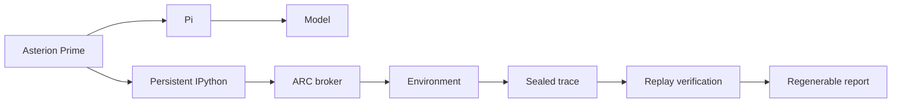

<p align="right"><strong>English</strong> | <a href="README.zh-CN.md">简体中文</a></p>

# Asterion

Composable, multi-runtime infrastructure for building verifiable agent applications.

Asterion separates capability packages, exact application assemblies, agent runtimes, host services, and controlled execution behind closed public contracts. Python owns orchestration and composition, TypeScript validates shared contracts and Node integration, and Rust owns controlled execution. The project is research-stage, with provider-free verification kept separate from operator-authorized model work.

## ARC-AGI-3 interactive reasoning

On 9 September 2026, native Asterion Prime completed **Level 1 of ARC-AGI-3 game `ls20-9607627b`** in one sealed run. It used Asterion's Pi integration with `deepseek-v4-flash`; it did not import or execute prime-agent source code.

<p align="center">
  
</p>

This is evidence for one completed interactive level—not a claim that Asterion has solved the complete ARC-AGI-3 benchmark or matched another system.

| Run fact | Recorded value |
|---|---:|
| Application / runtime | Asterion Prime / `asterion.prime`, using Pi |
| Model | `deepseek-v4-flash` |
| Actions | 23 |
| Visual observations | 30 frames, including multi-frame action animation |
| Reasoning cells | 43 |
| Partial game score | `3.267621` |
| Completion | 1 level; terminal state `level completed` |
| Evidence | sealed trace; replay verified |
| Token usage / elapsed time | not recorded by this legacy run; not estimated |

### What the task tests

ARC-AGI-3 is not a static “input grid → output grid” exercise. The agent receives a changing visual world and a small bounded action set, while the objective and object semantics are initially hidden. It must:

- infer what can be controlled and what constitutes progress;
- preserve state across a sequence of observations and actions;
- perform small, falsifiable experiments instead of committing to an early guess;
- revise its working model when the screen contradicts it; and
- finish by changing the environment into a success state, not by merely describing an answer.

In this level, repeated controlled movements revealed that the colored strips were fixed two-state objects rather than freely moving pieces. The agent compared corresponding row and column bands, tested reversibility, identified the remaining mismatches, and completed the required configuration in 23 actions. These statements are post-run interpretations grounded in the action and frame evidence; they are not a publication of hidden chain-of-thought.

### Solve and evidence path



Asterion Prime supplied the reusable agent loop: persistent programmatic state, model/tool interaction, bounded execution, and evidence capture. P7 supplied the ARC-AGI-3 application—its broker, action surface, task context, run limits, and completion handling. The environment, not the model, supplied the terminal completion fact.

### The complete solve report

The standalone report combines the replay, frame differences, evidence-cited narration, key experiments, and the post-solve model of the level. It is intentionally generated from stored run artifacts, so visual design and explanation can improve without changing the original solve.

<p align="center">
  
</p>

## How the evidence is preserved

ARC solve artifacts live in a stable `artifacts/arc-agi-3/` hierarchy during local research. Four layers stay separate:

1. **Normalized facts** — immutable run identity, actions, observations, terminal state, usage, and verification evidence.
2. **Versioned analysis** — evidence references and post-run explanations attached to the facts without rewriting them.
3. **Versioned rendering** — replaceable web presentation built from one exact analysis.
4. **Standalone export** — one self-contained HTML file with its data, styles, scripts, and images embedded for distribution.

Only the compact replay and approved screenshot are committed here. Private run artifacts remain outside the distribution, while the report can be regenerated locally from the retained evidence.

## Architecture

```text
CLI / host
  → selected application provider
  → exact assembly
  → capability catalog and deterministic composer
  → exact implementation bindings
  → sequential runner
  → runtime adapter and explicitly injected host services
```

The core contracts are `asterion.agent-runtime/v1`, `asterion.capability/v1`, `asterion.capability-package/v1`, and `asterion.application-assembly/v1`. Manifests describe compatibility, not authority: they contain no prompts, credentials, commands, executable paths, provider configuration, or mutable state.

Two peer agent surfaces share this framework:

- **Asterion Prime (`asterion.prime`)** implements reusable Prime-style capabilities over Asterion's common Pi transport. P1 through P7 are applications of this implementation, not its foundation.
- **Asterion Native (`asterion.native`)** is the peer native control-plane implementation. It currently remains a control provider rather than an `AgentRuntime` adapter.

Framework modules remain domain-neutral. DCI is the complete reference product and ARC-AGI-3 solving is an Asterion Prime application; neither is a dependency that generic composition or runtime code may assume.

## Install and inspect

Python 3.10 or newer and [`uv`](https://docs.astral.sh/uv/) are required. Node.js 22.x plus npm are needed for Pi and TypeScript integration; Rust is needed only for the controlled-executor checks.

```bash
uv sync --frozen
uv run asterion list
uv run asterion describe --provider dci-agent-lite
uv run asterion verify --provider dci-agent-lite --level acceptance
```

`list`, `describe`, and `acceptance` inspect installed metadata, exact assemblies, and executable reachability without constructing a model runtime or making a provider request.

## Generate an ARC solve report

The story pipeline accepts a retained sealed run and writes into the fixed local artifact hierarchy:

```bash
uv run asterion arc-story compile /absolute/path/to/sealed-run
uv run asterion arc-story analyze GAME_ID RUN_ID
uv run asterion arc-story render GAME_ID RUN_ID --analysis ANALYSIS_ID
uv run asterion arc-story export GAME_ID RUN_ID --render RENDER_ID
uv run asterion arc-story serve
```

`compile` normalizes and validates the original evidence. `analyze` is the only model-backed stage and requires operator-owned Pi/model configuration. `render`, `export`, and `serve` operate on stored artifacts; `export` produces a single distributable HTML file rather than a service-dependent page.

## External runtimes and resources

From a fresh clone, prepare the locked external Pi checkout and the small DCI resource profile with:

```bash
make setup
cp .env.template .env
# authenticate Pi and the independent Judge with operator-owned credentials
make doctor
```

Pi is external and pinned by `pi-revision.txt`; a global `pi` executable is not runtime authority. Authentication remains in the operator-managed Pi agent directory or environment. Corpora, datasets, credentials, generated outputs, and private evidence are never vendored into the Asterion package.

Setup may use network and disk, but performs zero Agent and zero Judge operations. Local corpus access can still send selected content to the configured model provider during an authorized run.

## DCI reference product

DCI exercises the generic framework with research, evaluation, benchmarking, analysis, and export capabilities. Provider-free discovery and planning remain separate from execution:

```bash
uv run asterion-dci benchmark instances --json
uv run asterion-dci benchmark lock \
  --instance dci.local-fixture@1.0.0 \
  --output "$OPERATOR_SELECTED_SOURCE_LOCK"
uv run asterion-dci benchmark plan \
  --instance dci.local-fixture@1.0.0 \
  --capability-source-lock "$OPERATOR_SELECTED_SOURCE_LOCK"
```

See the [DCI operator guide](docs/OPERATOR-GUIDE.md), [capability usage guide](docs/guides/asterion-capability-usage.md), and [documentation hub](docs/README.md).

## Security and cost boundaries

- `list`, `describe`, `acceptance`, `make test`, and `make check` are provider-free.
- Setup and preflight check external readiness but do not authorize model work.
- `basic` and `complete` may perform explicitly bounded Agent/Judge work.
- Full datasets, paper reproduction, and publication runs require separate operator authorization.
- Runners receive resolved plans and read-only host services; they do not discover, authorize, persist, schedule, retry, or choose runtimes.
- The Rust executor applies trusted policy, direct invocation, cleared environments, deadlines, output caps, and cancellation. It is controlled execution, not an OS sandbox.
- Public surfaces redact prompts, answers, credentials, provider payloads, private paths, corpus text, and raw model output.

## Development

```bash
make test
make lint
make docs-check
make check
```

The repository uses Python `unittest`, TypeScript contract validation, and Rust tests. Changes to packaged resources, entry points, schemas, or distribution assumptions additionally require `make promotion-check`.

The architectural starting points are [Agent application framework](docs/architecture/agent-framework.md), [Runtime/provider boundaries](docs/architecture/runtime-provider-boundaries.md), and [Agent Control Protocol](docs/architecture/AGENT-CONTROL-PROTOCOL.md).

## Promotion

```bash
make check
ASTERION_PROMOTION_NPM_CACHE="$(npm config get cache)" make promotion-check
```

`promotion-check` copies the standalone tree into a temporary directory and reruns provider-free distribution gates. It does not publish a package, create a remote, or run a provider.

## Compatibility and history

The repository still contains **Prime Gateway** compatibility and historical parity surfaces for controlled comparison with external Prime Agent source. They are not the implementation of native Asterion Prime and cannot establish native capability parity. The native `asterion.prime` path is source-independent and must remain completely detached from Prime Agent source and SDK code.

Likewise, the historical `538/538` delegated-selector matrix is mixed-repository DCI integration evidence, not a current standalone acceptance result. Current claims are tied to named commands and evidence boundaries rather than inherited snapshots.
