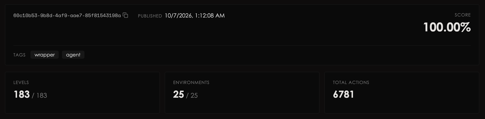
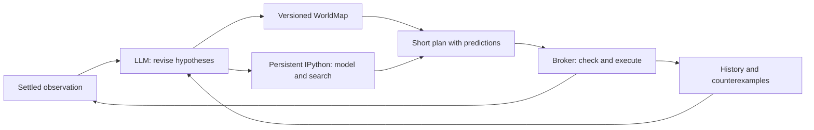
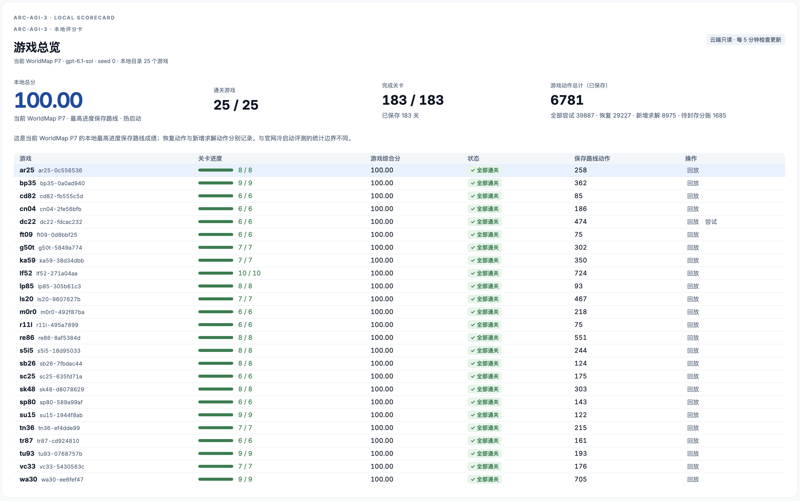
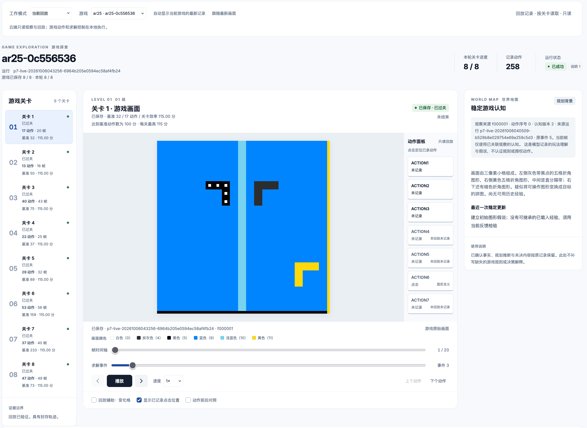

<p align="right"><strong>English</strong> | <a href="README.zh-CN.md">简体中文</a></p>

# Asterion

**A composable, multi-runtime agent application framework for sustained, evidence-driven research.**

Asterion Prime P7 studies interactive ARC-AGI-3 games by writing programs, testing hypotheses against real observations, and carrying useful experience into later attempts. Its producing system is public: the LLM, persistent IPython workspace, versioned WorldMap, checked action broker, experience store, and certification/submission code are in this repository.

## ARC-AGI-3: official result

On 7 October 2026 (UTC+8), Asterion Prime P7 achieved an **official ARC-AGI-3 score of 100.00**, completing **25/25 public games and 183/183 levels in 6,781 actions**. The [Competition scorecard](https://arcprize.org/scorecards/60c10b53-9b8d-4af9-aae7-85f81543198a) is normally closed, and its final receipt has been checked against every submitted route. The research model was `gpt-6.1-sol`, seed `0`; the final execution snapshot is [`2f258ff3`](https://github.com/uukuguy/asterion/tree/2f258ff3e74478805f63e08daa437acf9ca53a21). Earlier saved routes retain their original code identities and certificates.

[](https://arcprize.org/scorecards/60c10b53-9b8d-4af9-aae7-85f81543198a)

Official result: **100.00**, 25 games, 183 levels, 6,781 actions. [Full-page screenshot](docs/assets/arc-agi-3/p7-official-scorecard-full.png).

| Evidence | Status and meaning |
|---|---|
| Local saved routes | 25 games completed; 183 levels; 6,781 selected-route actions; local aggregate 100.000000 |
| Official full-catalog submission | [Competition scorecard](https://arcprize.org/scorecards/60c10b53-9b8d-4af9-aae7-85f81543198a) **100.00**; 25/25 games, 183/183 levels, 6,781 actions; normally closed receipt checked |
| Evaluation scope | Accumulated research on the 25 public games, seed 0 |

Read the [public result record](docs/results/arc-agi-3/README.md) and [machine-readable evidence](docs/results/arc-agi-3/p7-public-2026-10-07.json). Browse saved progress and replay in the [read-only console](https://asterion-p7-console.vercel.app); synchronized data may lag local research.

This is a warm-start, iterative public-game research result, with retained experience, retries, verified prefix reuse, operator scheduling, and application repairs during the campaign. P7 generated research programs, WorldMaps, and action choices. The 6,781 actions describe selected routes, not all exploration or total research cost. Official saved-route submission checks those routes in new online games without model inference; it is distinct from a fresh LLM solve. No private-set result, ARC Prize Verified status, or monetary total is claimed. A [scoped API-price estimate](docs/results/arc-agi-3/README.md#scoped-api-price-estimate) gives $147.46–$158.32 at Standard rates under an assumed 97% cached-read share; actual payment and complete research cost remain unknown.

## How P7 works


```mermaid
flowchart LR
    O[Settled observation] --> L[LLM: revise hypotheses]
    L --> W[Versioned WorldMap]
    L --> P[Persistent IPython: model and search]
    W --> A[Short plan with predictions]
    P --> A
    A --> B[Broker: check and execute]
    B --> O
    B --> E[History and counterexamples]
    E --> L
```

1. **Observe and describe.** The application supplies the actual settled frame, observation reference, current budget, and workspace revision. The LLM maintains a WorldMap with its scene description, candidate rules, goals, unknowns, competing hypotheses, and evidence-backed action labels. It uses unresolved questions to choose the next useful computation or discriminating experiment. Partial models are allowed.
2. **Build executable hypotheses.** A persistent IPython namespace holds Python state projections, transition functions, goal candidates, and searches across model turns. The read-only `p7_research` interface exposes recorded observations and history. The model compares alternatives without importing the game engine to search hidden state.
3. **Check the model against history.** Reports can predict previously observed cells, frame hashes, states, or completed levels. Host-side comparison records matches and counterexamples. When a historical check or real action contradicts a prediction, the LLM revises its WorldMap or program and recomputes the next plan. This retrodiction checks a stated claim against observed evidence; it does not certify every rule, the goal, or route optimality.
4. **Act with explicit predictions.** A short plan binds to the current observation and workspace version. The broker validates it, dispatches sequentially, and stops at the first mismatch, level boundary, RESET, or terminal condition. Unexecuted suffixes stay unexecuted; uncertain results do not authorize a retry.
5. **Learn from failure.** Later attempts can read same-game research, counterexamples, artifacts, and selected historical cells. Old programs are inert material to revise, not a script to replay wholesale. Prior evidence cannot authorize current actions. Independently checked completed prefixes can be restored in a new local game before work on its next level.

The current model-facing tool surface is exactly **`ipython`, `p7_workspace`, and `p7_execute_plan`**. These are registered application tools, not prompt-only names. Research and real action dispatch have separate interfaces. Board delivery uses a lossless palette/row dictionary when smaller, with raw-frame fallback and an exact raw research reader; this changes presentation, not game semantics or recorded evidence.

**RESET starts a new environment episode.** P7 preserves raw history, completed prefixes, and durable learned observations while clearing pending probes and executable planner authority. Current-episode support must be gathered again; pre-RESET evidence cannot silently become permission to execute a new plan.

The optional `fresh-target` quarantine policy is an **operator-selected intervention** that excludes explicitly identified prior target-level material while retaining a bound earlier-level prefix. It is not an automatic P7 decision.

### Inspect the producing code

| Surface | Public source |
|---|---|
| LLM guidance and registered tools | [Prompt](src/asterion/applications/prime/p7/prompt.py), [tool registry](src/asterion/applications/prime/p7/tool_registry.py), [TypeScript extension](packages/typescript/asterion-prime-extension) |
| Persistent programmatic research | [IPython host](src/asterion/applications/prime/p7/ipython_host.py), [research runtime](src/asterion/applications/prime/p7/research_runtime.py), [research bridge](src/asterion/applications/prime/p7/research_bridge.py) |
| WorldMap, checks, and actions | [Research workspace](src/asterion/applications/prime/p7/research.py), [world model](src/asterion/applications/prime/p7/world_model.py), [broker](src/asterion/applications/prime/p7/broker.py) |
| Retained experience and delivery | [Experience loader](src/asterion/applications/prime/p7/experience.py), [induction](src/asterion/applications/prime/p7/experience_induction.py), [actor projection](src/asterion/applications/prime/p7/actor_projection.py) |
| Save-time authority and official replay | [Certificates](src/asterion/applications/prime/p7/solution_certificates.py), [official operator](src/asterion/applications/prime/p7/official_operator.py), [online replay](src/asterion/applications/prime/p7/official_replay.py) |

## Console and replay

The [read-only console](https://asterion-p7-console.vercel.app) shows saved research progress and route replay; synchronized data may lag local research. Click either screenshot to view it at full size.

[](docs/assets/arc-agi-3/p7-console-overview.png)

Local saved-route progress: **100**, 25 games and 183 levels completed.

[](docs/assets/arc-agi-3/p7-console-game.png)

AR25 game scene, WorldMap and replay timeline from local research. Official results are documented by the scorecard above.

## Reproduce and inspect

Start with the [community reproduction guide](docs/guides/prime-p7-community-reproduction.md) for external prerequisites, exact model selection, the current OrbStack launcher, and local/official commands.

Framework inspection requires Python 3.10+ and `uv`, with no model credentials:

```bash
uv sync --frozen
uv run asterion list
uv run asterion describe --provider dci-agent-lite
```

After preparing your own Pi runtime/profile, ARC game assets and SDK wheels, operator credentials, and guest paths, run one bounded local research attempt:

```bash
make asterion-prime-p7-sync-games
make asterion-prime-p7-games
make asterion-prime-p7-level-witness GAME=ls20 LEVEL=1
make p7-controller
```

Catalog synchronization uses network GETs, without a scorecard or model. The level witness invokes the model and the OFFLINE game. `LEVEL=N` means completing levels 1 through N in order. The console serves at `http://127.0.0.1:57515/`; viewing it does not start a solve, while its explicit controls can start game work. New operators build their own research records and certified routes.

Only after preparing your own certified routes and deciding to perform an official submission:

```bash
make asterion-prime-p7-official-preflight
make asterion-prime-p7-official-submit GAME=all
```

The latter creates a new Competition scorecard and executes real online actions. Local files are not uploaded as scores. A final result comes from the closed server scorecard and checked receipt. See the [detailed operator guide](docs/guides/prime-p7-games-and-official-results.md) for single-game submission and recovery.

## The framework underneath

The authoritative distribution is the Python wheel defined by [pyproject.toml](pyproject.toml) and implemented in `src/asterion/`. Python owns orchestration, composition, assembly, and execution; TypeScript validates shared contracts and Node integration; Rust owns controlled execution.

```text
CLI / host → selected provider → assembly → catalog / composer
           → exact implementations → runner → runtime / host services
```

Capabilities and applications use exact versioned identities. Composition rejects missing edges, ambiguity, and cycles. Framework modules remain domain-neutral; products depend on them. DCI is a reference product, not a dependency that generic framework modules assume.

The closed contracts are `asterion.agent-runtime/v1`, `asterion.capability/v1`, `asterion.capability-package/v1`, and `asterion.application-assembly/v1`. Schemas, Python/TypeScript validators, and conformance fixtures agree. Manifests express compatibility; they contain no prompts, credentials, commands, executable paths, provider settings, or mutable state.

| Implementation / application | Role |
|---|---|
| Asterion Prime (`asterion.prime`) | Source-independent Prime-style agent over Pi transport and programmatic state; P1–P7 are its applications |
| Asterion Native (`asterion.native`) | Peer control-plane provider; currently not an `AgentRuntime` adapter |
| P1–P6 | Persistent computation, programmatic long context, recursive work, bounded autonomy, and continual execution |
| DCI | Reference research/evaluation/benchmark/analysis/export product |
| Controlled code | Capability execution through explicitly injected host authority |

Native Asterion Prime does not import or require external Prime Agent source or SDK code. Pi is an external transport/runtime dependency. Historical Prime Gateway comparison surfaces and mixed-repository parity results are documented separately and do not establish native capability parity.

## Safety, development, and documentation

The host owns credentials, policy, cancellation, data, and execution authority. Runners execute resolved plans sequentially; they do not discover, authorize, retry, persist, schedule, or choose runtimes. The Rust executor enforces trusted command policy, clean environments, deadlines, output caps, and cancellation; it is not an OS sandbox. Retained evidence and configuration never grant execution authority.

Public evidence excludes credentials, provider payloads, private prompts, raw research output, and private host paths. Public replay presents an application-approved projection. Runtime streams require one run identity, contiguous events, matched calls/results, and one terminal event.

```bash
make test
make lint
make docs-check
make check
```

`make promotion-check` verifies packaged resources and distribution boundaries without publishing or calling a model provider. These checks establish their named software boundaries, not ARC benchmark performance.

- [Documentation hub](docs/README.md) and [DCI operator guide](docs/OPERATOR-GUIDE.md)
- [Framework architecture](docs/architecture/agent-framework.md) and [runtime/provider boundaries](docs/architecture/runtime-provider-boundaries.md)
- [Capability usage](docs/guides/asterion-capability-usage.md), [Agent Control Protocol](docs/architecture/AGENT-CONTROL-PROTOCOL.md), and [security](docs/security.md)
- [Research history and evidence](docs/status/ASTERION-PRIME-P7-EVIDENCE.md), including the September 2026 single-level LS20 demonstration
