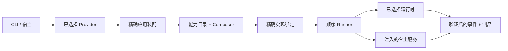
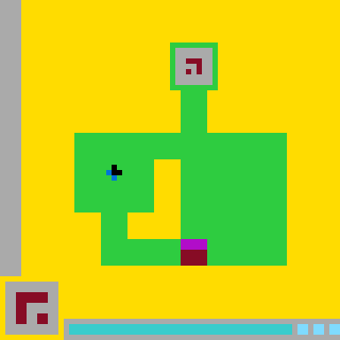
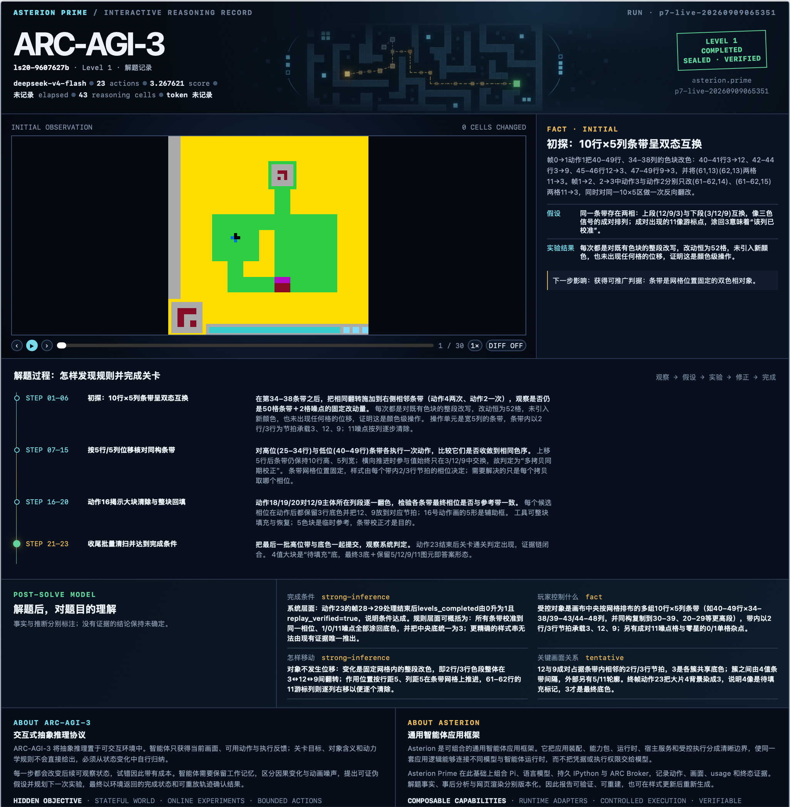

<p align="right"><a href="README.md">English</a> | <strong>简体中文</strong></p>

# Asterion

**可组合、多运行时的智能体应用框架。**

Asterion 将智能体能力组织为身份精确、可以执行的应用，同时不把凭据、权限或基础设施交给模型。它为能力和运行时提供版本化协议，以确定性方式装配应用，控制执行边界，并保留能够脱离模型输出独立检查的证据。

本仓库包含权威 Python 框架 `src/asterion/`、共享 TypeScript 协议与 Node 集成、Rust 受控执行器、内置应用 Provider、schema、一致性测试夹具及操作文档。

## 为什么需要 Asterion

智能体应用不只是一个提示词加工具循环。它的真实行为取决于选择了哪份能力实现、由哪个运行时执行、宿主授权了哪些服务，以及运行后留下了什么证据。Asterion 将这些决定全部显式化：

- **可组合能力**——应用由身份精确、带版本的能力包装配，而不是依赖隐藏的源码扫描。
- **多运行时**——应用协议保持稳定，Pi、Claude Code 或应用自有运行时负责把原生事件翻译成统一公共协议。
- **确定性装配**——依赖缺失、身份重复、实现歧义和依赖环会在执行前关闭失败。
- **宿主掌握权限**——凭据、执行策略、数据集、取消信号和 Provider 配置不进入可移植 Manifest，只能由宿主显式注入。
- **可验证运行**——经过验证的事件流、不可变制品、回执、封存轨迹和回放检查，将环境事实与模型宣称分开。

## 架构



依赖方向是刻意固定的：

```text
CLI / 宿主 → 已选择 Provider → 装配 → 能力目录 / Composer
           → 精确实现 → Runner → 运行时 / 宿主服务
```

`runtime/`、`packages/`、`assembly/`、`runner/` 和 `services/` 下的框架模块保持领域中立。产品和应用可以依赖框架；通用框架代码不能反向导入 DCI、ARC-AGI-3、测试代码或相邻源码树。

语言职责同样明确：**Python** 负责编排、组合、装配和执行流程；**TypeScript** 验证共享协议和 Node 集成；**Rust** 负责受控命令执行。Rust 执行器应用可信策略、直接调用、清空环境、超时、输出上限和取消机制，但它不是操作系统沙箱。

## 核心组成

| 组成 | 职责 |
|---|---|
| Runtime Protocol | 保证单一运行身份、连续事件、配对的工具调用/结果、取消语义以及唯一终态 |
| 能力包 | 描述带版本行为、兼容边、制品、策略和精确实现绑定 |
| 应用装配 | 绑定精确能力引用、运行时兼容性和所需宿主服务 |
| Provider | 发布已安装应用，并只加载由精确身份选择的入口点 |
| Composer | 生成确定性执行计划，并拒绝歧义、缺失依赖和依赖环 |
| Runner | 顺序执行已解析计划；不负责发现、授权、重试、持久化、调度或选择运行时 |
| 宿主服务 | 仅在宿主预检后注入窄接口、由操作者掌握的能力 |
| 证据 | 公共安全事件、不可变制品、回执、摘要、封存轨迹与回放验证 |

封闭的 v1 协议包括：

- `asterion.agent-runtime/v1`
- `asterion.capability/v1`
- `asterion.capability-package/v1`
- `asterion.application-assembly/v1`

它们的 JSON schema、Python 验证器、TypeScript 验证器和一致性夹具必须保持一致。Manifest 只描述兼容性，不提供权限：其中绝不包含提示词、凭据、命令、可执行路径、环境值、Provider 配置或可变状态。

## 智能体实现

| 实现 | 当前职责 |
|---|---|
| **Asterion Prime**（`asterion.prime`） | 基于 Asterion Pi 传输、持久程序状态、边界执行和证据记录的源码独立 Prime 风格智能体实现 |
| **Asterion Native**（`asterion.native`） | 共享同一套 Asterion 框架协议的同级原生控制面实现；目前是控制 Provider，而不是 `AgentRuntime` 适配器 |

P1 到 P7 是建立在 Asterion Prime 能力之上的应用，不是 Prime 基础能力本身。原生 Asterion Prime 不导入、不加载、不启动、不检查，也不依赖 prime-agent 源码或 SDK。

## 应用

Asterion 是框架；具体行为由基于能力装配出的应用承载。

| 应用表面 | 检验的能力 |
|---|---|
| P1–P6 | 持久 IPython、程序化长上下文、递归工作流、推理扩展、持续执行等 Prime 风格应用模式 |
| P7 / ARC-AGI-3 | 有状态视觉交互、在线实验、受限动作、环境反馈及可回放解题证据 |
| DCI | 覆盖研究、评估、基准、分析和导出的完整参考产品 |
| Controlled code | 通过显式注入的受控宿主服务完成能力组合与执行 |

### ARC-AGI-3 交互推理解题

2026 年 9 月 9 日，Asterion Prime 在一次封存运行中通过 Pi 和 `deepseek-v4-flash` 完成了 **游戏 `ls20-9607627b` 的 Level 1**。它展示的是 Asterion 的一个应用，并不表示完整 ARC-AGI-3 基准已经解开，也不主张与其他智能体能力相同。

<p align="center">
  
</p>

| 动作 | 画面帧 | 推理单元 | 部分得分 | 结果 | 证据 |
|---:|---:|---:|---:|---|---|
| 23 | 30 | 43 | `3.267621` | 完成 1 个关卡 | 轨迹已封存；回放验证通过 |

ARC-AGI-3 将目标和对象语义隐藏在有状态环境中。智能体必须通过规模小、可证伪的动作学习规则，记住画面变化，修正被否定的假设，并最终让环境报告成功。在本关中，受控实验揭示了位置固定的双状态同行/同列条带；对照与可逆探测定位了剩余不匹配项。该早期运行未记录 Token 与用时，因此不作估算。

`Asterion Prime → Pi → 模型 → 持久 IPython → ARC Broker → 环境 → 封存轨迹 → 回放验证`

<p align="center">
  
</p>

报告将规范化事实、版本化事后分析、版本化渲染和单文件导出分开。讲解引用保存的动作/画面证据，不公开隐藏思维链。保留的封存运行可以重新生成并导出成一个可分发 HTML 文件：

```bash
uv run asterion arc-story compile /absolute/path/to/sealed-run
uv run asterion arc-story analyze GAME_ID RUN_ID
uv run asterion arc-story render GAME_ID RUN_ID --analysis ANALYSIS_ID
uv run asterion arc-story export GAME_ID RUN_ID --render RENDER_ID
uv run asterion arc-story serve
```

`analyze` 是调用模型的阶段；compile、render、export 和 serve 只处理保留证据。本地研究制品统一进入稳定的 `artifacts/arc-agi-3/` 层级，并始终留在发行包之外。

## 安装与无模型检查

项目要求 Python 3.10 或更高版本以及 [`uv`](https://docs.astral.sh/uv/)。Pi 和 TypeScript 集成需要 Node.js 22.x 与 npm；受控执行器检查需要 Rust。

```bash
uv sync --frozen
uv run asterion list
uv run asterion describe --provider dci-agent-lite
uv run asterion verify --provider dci-agent-lite --level acceptance
```

`list`、`describe` 和 `acceptance` 只检查已安装元数据、精确装配及实现可达性，不构造模型运行时，也不会请求模型 Provider。

能力包可以内置、通过发行入口安装，或从显式本地目录选择；所有形式遵循同一协议。来源解析没有隐藏优先级：同一精确身份存在多个候选时保持歧义，直到宿主提供精确来源锁。

## 外部运行时与资源

新克隆仓库可以用以下命令准备锁定的外部 Pi checkout 和小规模 DCI 资源：

```bash
make setup
cp .env.template .env
# 使用操作者自己的凭据登录 Pi 和独立 Judge
make doctor
```

Pi 始终是外部资源并由 `pi-revision.txt` 固定版本；全局 `pi` 命令不是运行时权威。认证信息属于操作者管理的 Pi agent 目录或环境。语料、数据集、凭据、私有证据和生成输出始终在 Asterion 发行包之外。

Setup 和 preflight 可以检查网络、磁盘及外部就绪状态，但 Agent 与 Judge 操作数均为零。调用 Provider 的 `basic` 与 `complete` 预置有单独的有限边界。完整数据集、论文复现和发布运行需要另行取得操作者授权。

DCI 的无模型目录与计划界面可以在不加载模型时检查：

```bash
uv run asterion-dci benchmark instances --json
uv run asterion-dci benchmark lock \
  --instance dci.local-fixture@1.0.0 \
  --output "$OPERATOR_SELECTED_SOURCE_LOCK"
uv run asterion-dci benchmark plan \
  --instance dci.local-fixture@1.0.0 \
  --capability-source-lock "$OPERATOR_SELECTED_SOURCE_LOCK"
```

更多内容见[文档索引](docs/README.md)、[DCI 操作指南](docs/OPERATOR-GUIDE.md)和[能力使用指南](docs/guides/asterion-capability-usage.md)。

## 安全与执行边界

- 信任边界失败必须在执行前关闭失败。
- 公共界面隐藏提示词、答案、凭据、Provider payload、语料正文、原始输出、宿主服务值和私有路径。
- 运行时流必须只有一个运行 ID、连续序号、配对的工具调用/结果以及唯一终态。
- Runner 只接收已解析计划、精确实现、取消信号和只读宿主服务。
- `executor.controlled` 本身不授权命令；由操作者掌握的宿主在预检后注入权限。
- 配置、缓存、历史计划和已有证据都不能授予执行权限。

## 开发与发布检查

```bash
make test
make lint
make docs-check
make check
```

修改发行资源、入口点、schema 或发行假设后运行 `make promotion-check`。它把独立源码树复制到临时目录并重新运行无模型发行检查；不会发布包，也不会调用模型 Provider。

架构资料：

- [智能体应用框架](docs/architecture/agent-framework.md)
- [运行时与 Provider 边界](docs/architecture/runtime-provider-boundaries.md)
- [Agent Control Protocol](docs/architecture/AGENT-CONTROL-PROTOCOL.md)
- [安全边界](docs/security.md)

## 兼容与历史说明

仓库保留 **Prime Gateway** 兼容层和历史对照表面，用于与外部 Prime Agent 源码进行受控比较。它们不是原生 Asterion Prime，也不能证明原生能力已经对齐。原生 `asterion.prime` 路径保持源码独立，与 Prime Agent 源码及 SDK 完全脱钩。

历史 `538/538` delegated-selector 矩阵是混合仓库的 DCI 集成证据，不是当前独立仓库的验收结果。当前能力陈述只绑定到具名验证命令和明确证据边界，不继承旧快照结论。
