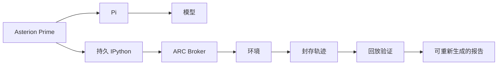

<p align="right"><a href="README.md">English</a> | <strong>简体中文</strong></p>

# Asterion

用于构建可验证智能体应用的可组合、多运行时基础框架。

Asterion 通过封闭的公共协议，将能力包、精确应用装配、智能体运行时、宿主服务和受控执行分开。Python 负责编排与组合，TypeScript 验证共享协议及 Node 集成，Rust 负责受控执行。项目目前处于研究阶段，并严格区分无模型供应商的验证与由操作者明确授权的模型执行。

## ARC-AGI-3 交互推理解题

2026 年 9 月 9 日，原生 Asterion Prime 在一次封存运行中完成了 **ARC-AGI-3 游戏 `ls20-9607627b` 的 Level 1**。本次运行通过 Asterion 的 Pi 集成使用 `deepseek-v4-flash`，没有导入或执行 prime-agent 源码。

<p align="center">
  
</p>

这份证据只证明一个交互关卡已经完成，不表示 Asterion 已解开完整 ARC-AGI-3 基准，也不主张与其他系统达到同等能力。

| 运行事实 | 记录值 |
|---|---:|
| 应用 / 运行时 | Asterion Prime / `asterion.prime`，使用 Pi |
| 模型 | `deepseek-v4-flash` |
| 动作 | 23 |
| 视觉观察 | 30 帧，包含动作的多帧动画 |
| 推理单元 | 43 |
| 游戏部分得分 | `3.267621` |
| 完成状态 | 完成 1 个关卡；终态为 `level completed` |
| 证据 | 轨迹已封存；回放验证通过 |
| Token / 用时 | 该早期运行未记录，因此不作估算 |

### 这道题考查什么

ARC-AGI-3 不是静态的“输入网格 → 输出网格”题。智能体面对的是一个随动作变化的视觉世界和一组受限动作，而任务目标及对象语义起初并不公开。它必须：

- 推断哪些对象可以控制、什么变化代表进展；
- 在连续的观察与动作之间保持状态；
- 先做规模小、可证伪的实验，而不是过早认定规则；
- 当画面否定假设时修正工作模型；
- 通过改变环境达到成功状态，而不是只用文字描述答案。

在这个关卡中，连续的受控移动逐步表明，彩色条带是位置固定的双状态对象，而不是可自由移动的棋子。智能体对照同行、同列条带，验证操作是否可逆，定位仍未匹配的部分，并以 23 个动作完成要求的配置。这些是依据动作与画面证据形成的事后解释，不是公开隐藏的思维链。

### 解题与证据链路



Asterion Prime 提供可复用的智能体循环：持久化程序状态、模型与工具交互、边界受控执行以及证据记录。P7 提供 ARC-AGI-3 应用，包括 Broker、动作接口、任务上下文、运行限制和完成状态处理。最终的关卡完成事实来自环境，而不是模型自己的宣称。

### 完整解题报告

单文件报告汇集过程回放、帧差异、带证据引用的讲解、关键实验以及解题后对关卡规则的理解。它由保存的运行制品生成，因此后续可以改进视觉设计和讲解方式，而不篡改原始解题记录。

<p align="center">
  
</p>

## 证据如何保存

本地研究中的 ARC 解题制品统一存放在稳定的 `artifacts/arc-agi-3/` 层级中，四层数据彼此分离：

1. **规范化事实**——不可变的运行身份、动作、观察、终态、usage 与验证证据。
2. **版本化分析**——在不改写事实的前提下，为证据添加引用和事后解释。
3. **版本化渲染**——基于某个精确分析版本生成、可以替换的网页展示。
4. **单文件导出**——将数据、样式、脚本和图片内嵌为一个可直接分发的 HTML 文件。

仓库这里只提交精简回放和经确认的截图。私有运行制品不进入发行包；保留原始证据后，可以在本地重新生成报告。

## 架构

```text
CLI / 宿主
  → 已选择的应用 Provider
  → 精确装配
  → 能力目录与确定性 Composer
  → 精确实现绑定
  → 顺序 Runner
  → 运行时适配器与显式注入的宿主服务
```

核心协议包括 `asterion.agent-runtime/v1`、`asterion.capability/v1`、`asterion.capability-package/v1` 和 `asterion.application-assembly/v1`。Manifest 只描述兼容性，不授予权限：其中不包含提示词、凭据、命令、可执行路径、Provider 配置或可变状态。

两个同级智能体表面共享这套框架：

- **Asterion Prime（`asterion.prime`）**基于 Asterion 公共 Pi 传输实现可复用的 Prime 风格能力。P1 到 P7 是该实现之上的应用，而不是它的基础能力本身。
- **Asterion Native（`asterion.native`）**是同级的原生控制面实现。目前它仍是控制 Provider，而不是 `AgentRuntime` 适配器。

框架模块保持领域中立。DCI 是完整的参考产品，ARC-AGI-3 解题是 Asterion Prime 应用；通用组合或运行时代码都不能反向依赖它们。

## 安装与无模型检查

项目要求 Python 3.10 或更高版本以及 [`uv`](https://docs.astral.sh/uv/)。Pi 和 TypeScript 集成需要 Node.js 22.x 与 npm；只有受控执行器检查需要 Rust。

```bash
uv sync --frozen
uv run asterion list
uv run asterion describe --provider dci-agent-lite
uv run asterion verify --provider dci-agent-lite --level acceptance
```

`list`、`describe` 和 `acceptance` 只检查已安装元数据、精确装配及可执行可达性，不构造模型运行时，也不会请求模型 Provider。

## 生成 ARC 解题报告

解题叙事流水线接收一份保留的封存运行，并写入固定的本地制品层级：

```bash
uv run asterion arc-story compile /absolute/path/to/sealed-run
uv run asterion arc-story analyze GAME_ID RUN_ID
uv run asterion arc-story render GAME_ID RUN_ID --analysis ANALYSIS_ID
uv run asterion arc-story export GAME_ID RUN_ID --render RENDER_ID
uv run asterion arc-story serve
```

`compile` 负责规范化并验证原始证据。`analyze` 是唯一调用模型的阶段，需要操作者自己管理的 Pi / 模型配置。`render`、`export` 和 `serve` 只处理已经保存的制品；`export` 生成一个可直接分发的单文件 HTML，而不是必须依赖服务才能打开的页面。

## 外部运行时与资源

新克隆的仓库可用以下命令准备锁定的外部 Pi checkout 和小规模 DCI 资源：

```bash
make setup
cp .env.template .env
# 使用操作者自己的凭据登录 Pi 和独立 Judge
make doctor
```

Pi 始终是外部资源，并由 `pi-revision.txt` 固定版本；全局 `pi` 命令不是运行时权威。认证信息保留在操作者管理的 Pi agent 目录或环境中。语料、数据集、凭据、生成输出和私有证据都不会被 vendoring 进 Asterion 包。

Setup 可能访问网络和磁盘，但 Agent 与 Judge 操作数均为零。本地语料访问仍可能在授权运行期间，将被选择的内容发送给已配置的模型 Provider。

## DCI 参考产品

DCI 以研究、评估、基准、分析和导出能力完整检验通用框架。无模型的发现与规划始终和执行分离：

```bash
uv run asterion-dci benchmark instances --json
uv run asterion-dci benchmark lock \
  --instance dci.local-fixture@1.0.0 \
  --output "$OPERATOR_SELECTED_SOURCE_LOCK"
uv run asterion-dci benchmark plan \
  --instance dci.local-fixture@1.0.0 \
  --capability-source-lock "$OPERATOR_SELECTED_SOURCE_LOCK"
```

更多内容见 [DCI 操作指南](docs/OPERATOR-GUIDE.md)、[能力使用指南](docs/guides/asterion-capability-usage.md)和[文档索引](docs/README.md)。

## 安全与成本边界

- `list`、`describe`、`acceptance`、`make test` 和 `make check` 不调用模型 Provider。
- Setup 和 preflight 只检查外部资源是否就绪，不授权模型工作。
- `basic` 和 `complete` 可以执行有明确边界的 Agent / Judge 工作。
- 完整数据集、论文复现和发布运行需要另行获得操作者授权。
- Runner 只接收已解析计划和只读宿主服务；它不负责发现、授权、持久化、调度、重试或选择运行时。
- Rust 执行器应用可信策略、直接调用、清空环境、超时、输出上限和取消机制。它属于受控执行，不是操作系统沙箱。
- 公共界面会隐藏提示词、答案、凭据、Provider payload、私有路径、语料正文和原始模型输出。

## 开发

```bash
make test
make lint
make docs-check
make check
```

仓库使用 Python `unittest`、TypeScript 协议验证和 Rust 测试。修改发行资源、入口点、schema 或发行假设后，还必须运行 `make promotion-check`。

架构入口包括 [智能体应用框架](docs/architecture/agent-framework.md)、[运行时与 Provider 边界](docs/architecture/runtime-provider-boundaries.md)以及 [Agent Control Protocol](docs/architecture/AGENT-CONTROL-PROTOCOL.md)。

## 发布前检查

```bash
make check
ASTERION_PROMOTION_NPM_CACHE="$(npm config get cache)" make promotion-check
```

`promotion-check` 会把独立源码树复制到临时目录并重新运行无模型的发行检查。它不会发布包、创建远程仓库或运行模型 Provider。

## 兼容与历史说明

仓库仍保留 **Prime Gateway** 兼容层和历史对照表面，用于与外部 Prime Agent 源码进行受控比较。它们不是原生 Asterion Prime 的实现，也不能证明原生能力已经对齐。原生 `asterion.prime` 路径独立于该源码，必须始终与 Prime Agent 源码及 SDK 完全脱钩。

同样，历史 `538/538` delegated-selector 矩阵是混合仓库的 DCI 集成证据，不是当前独立仓库的验收结果。当前项目只基于具名命令和明确证据边界陈述能力，不继承旧快照结论。
