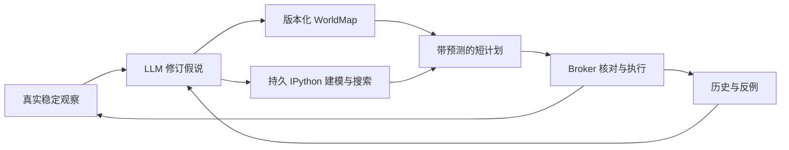

<p align="right"><a href="README.md">English</a> | <strong>简体中文</strong></p>

# Asterion

**面向持续研究、以证据驱动的可组合多运行时智能体应用框架。**

Asterion Prime P7 通过编程、真实观察和可修正的假说研究 ARC-AGI-3 交互游戏，并把有用经验带入后续尝试。产生结果的系统代码在本仓库公开：包括 LLM、持久 IPython 工作区、版本化 WorldMap、预测核对与动作 Broker、经验存储，以及认证和提交流程。

## ARC-AGI-3 当前结果

截至 **2026 年 10 月 7 日（UTC+8）**，累计公开题研究记录达到 **25/25 题、183/183 关**，选定保存路线共 **6,781 个动作**，**本地汇总分 100.000000**。选定路线记录模型 `gpt-6.1-sol`、seed `0`；最终执行版本为 [`2f258ff3`](https://github.com/uukuguy/asterion/tree/2f258ff3e74478805f63e08daa437acf9ca53a21)。此前保存的路线保留原始代码身份和认证。

| 证据 | 状态及含义 |
|---|---|
| 本地保存路线 | 25 题全通、183 关、6,781 个选定路线动作、本地汇总 100.000000 |
| 官方完整目录提交 | [Competition 成绩卡](https://arcprize.org/scorecards/60c10b53-9b8d-4af9-aae7-85f81543198a) **确认中**；最终服务端成绩须由正常关闭、核对通过的回执确认 |
| 评估范围 | 在 25 道公开题上累计研究，seed 0 |

查看[公开结果说明](docs/results/arc-agi-3/README.md)及[机器可读证据](docs/results/arc-agi-3/p7-public-2026-10-07.json)。[只读控制台](https://asterion-p7-console.vercel.app)展示保存进度和回放；它通过同步更新，可能落后于本地研究。

这是复用既有经验的公开题迭代研究结果，包含经验积累、重试、已验证前缀复用、操作者调度及研究中途的应用修复。P7 生成研究程序、WorldMap 和行动选择。6,781 个动作指选定路线，不包含所有探索，也不是研究总成本。官方保存路线提交不调用模型，在新的在线局中核对路线有效性，与全新 LLM 求解口径不同。本页不宣称私有题结果、ARC Prize Verified 身份或货币总成本。

## P7 的方法


```mermaid
flowchart LR
    O[真实稳定观察] --> L[LLM 修订假说]
    L --> W[版本化 WorldMap]
    L --> P[持久 IPython 建模与搜索]
    W --> A[带预测的短计划]
    P --> A
    A --> B[Broker 核对与执行]
    B --> O
    B --> E[历史与反例]
    E --> L
```

1. **观察并描述。** 应用提供真实稳定帧、观察引用、当前预算和工作区版本。LLM 在 WorldMap 中记录场景、候选规则、目标、未知、竞争假说以及有证据的动作含义；允许不完整模型。
2. **编写可执行假说。** 持久 IPython namespace 保存 Python 状态投影、转移函数、目标候选和搜索程序，跨模型回合继续使用。只读 `p7_research` 提供真实观察和历史；模型不能导入真实游戏引擎、搜索隐藏状态来取答案。
3. **用历史核对模型。** 报告可预测已发生序号的像素、画面摘要、状态或关卡数，由宿主与真实证据比较并返回反例。这种回溯预测核对只检验相应主张，不证明所有规则、目标或路线最优性。
4. **带明确预测行动。** 短计划绑定当前观察与工作区版本。Broker 先校验，再逐步执行；首次失配、过关、RESET 或终局立即停止后缀。未执行动作不算作已执行；结果不确定时不能自动重派。
5. **从失败中保留经验。** 后续尝试可读取同题研究、反例、制品和部分历史 cells。旧程序是需要选择与修订的资料，不能整体重播；旧证据不能授权本次动作。独立核对的已完成前缀可以在新本地局中恢复，再研究下一关。

当前模型工具面恰为 **`ipython`、`p7_workspace`、`p7_execute_plan`**，通过应用实际注册，不靠提示词假装工具。研究计算和真实动作派发有独立接口。画面在更省空间时采用无损调色板与行字典表示，否则返回原始帧；研究接口可读取精确原始画面。此投影只改变呈现，不改游戏语义或记录证据。

**RESET 是环境 episode 边界。** 原始历史、已完成前缀和持久学习记录保留，待执行探针及规划执行权限清除。新 episode 的支持证据需重新获得，RESET 前的证据不能悄然变成本次计划的执行许可。

可选的 `fresh-target` 隔离策略由**操作者明确选择**：排除指定的旧目标关材料，同时保留绑定的前面关卡前缀。它不是 P7 自动作出的决定。

### 检查产生结果的代码

| 表面 | 公开源码 |
|---|---|
| LLM 指导与工具注册 | [Prompt](src/asterion/applications/prime/p7/prompt.py)、[工具注册表](src/asterion/applications/prime/p7/tool_registry.py)、[TypeScript 扩展](packages/typescript/asterion-prime-extension) |
| 持久程序研究 | [IPython host](src/asterion/applications/prime/p7/ipython_host.py)、[研究运行时](src/asterion/applications/prime/p7/research_runtime.py)、[研究桥接](src/asterion/applications/prime/p7/research_bridge.py) |
| WorldMap、核对与动作 | [研究工作区](src/asterion/applications/prime/p7/research.py)、[World model](src/asterion/applications/prime/p7/world_model.py)、[Broker](src/asterion/applications/prime/p7/broker.py) |
| 经验与观察交付 | [经验加载](src/asterion/applications/prime/p7/experience.py)、[归纳](src/asterion/applications/prime/p7/experience_induction.py)、[Actor projection](src/asterion/applications/prime/p7/actor_projection.py) |
| 保存认证与官方重放 | [认证](src/asterion/applications/prime/p7/solution_certificates.py)、[官方操作入口](src/asterion/applications/prime/p7/official_operator.py)、[在线重放](src/asterion/applications/prime/p7/official_replay.py) |

## 复现与检查

先阅读[社区复现指南](docs/guides/prime-p7-community-reproduction.md)，其中列明外部资源、准确模型选择、当前 OrbStack 启动入口，以及本地／官方运行命令。

框架只读检查需要 Python 3.10+ 和 `uv`，不需要模型凭据：

```bash
uv sync --frozen
uv run asterion list
uv run asterion describe --provider dci-agent-lite
```

准备好自己的 Pi 运行时与 profile、ARC 游戏资源和 SDK wheels、操作者凭据及 guest 路径后，执行一次有限本地研究：

```bash
make asterion-prime-p7-sync-games
make asterion-prime-p7-games
make asterion-prime-p7-level-witness GAME=ls20 LEVEL=1
make p7-controller
```

目录同步仅发出网络 GET，不建成绩卡、不调用模型。Level witness 调用模型和 OFFLINE 游戏；`LEVEL=N` 表示顺序完成第 1 至第 N 关。控制台地址为 `http://127.0.0.1:57515/`，查看页面不会自动解题，显式操作可以启动游戏工作。新操作者通过运行系统积累自己的研究记录和认证路线。

只有准备好自己的认证路线、并决定进行官方提交之后，再执行：

```bash
make asterion-prime-p7-official-preflight
make asterion-prime-p7-official-submit GAME=all
```

后一个命令会创建新的 Competition 成绩卡并执行真实在线动作，不上传本地文件作为成绩。最终结果来自关闭后的服务端成绩卡和核对回执。单题提交与恢复流程见[详细操作指南](docs/guides/prime-p7-games-and-official-results.md)。

## 底层框架

权威发布物是根 [pyproject.toml](pyproject.toml) 定义、`src/asterion/` 实现的 Python wheel。Python 负责编排、组合、装配和执行；TypeScript 验证共享协议及 Node 集成；Rust 负责受控执行。

```text
CLI / 宿主 → 已选择 Provider → 装配 → catalog / composer
           → 精确实现 → runner → runtime / 宿主服务
```

能力与应用使用精确版本身份，装配拒绝缺边、歧义和依赖环。通用框架模块保持领域中立，产品依赖框架。DCI 是参考产品，不能成为通用框架默认依赖。

封闭协议为 `asterion.agent-runtime/v1`、`asterion.capability/v1`、`asterion.capability-package/v1` 和 `asterion.application-assembly/v1`；schema、Python/TypeScript 验证器及一致性夹具须一致。Manifest 只描述兼容性，不包含提示词、凭据、命令、可执行路径、Provider 设置或可变状态。

| 实现／应用 | 职责 |
|---|---|
| Asterion Prime（`asterion.prime`） | 基于 Pi 传输与程序状态的源码独立 Prime 风格智能体；P1–P7 是其应用 |
| Asterion Native（`asterion.native`） | 同级控制面 Provider，目前不是 `AgentRuntime` 适配器 |
| P1–P6 | 持久计算、程序化长上下文、递归工作、有界自治与持续执行 |
| DCI | 研究、评估、基准、分析和导出的参考产品 |
| Controlled code | 通过显式注入的宿主权限执行能力 |

原生 Asterion Prime 不导入或依赖外部 Prime Agent 源码与 SDK；Pi 是外部传输／运行时依赖。历史 Prime Gateway 对照及混合仓库 parity 结果独立归档，不能证明原生能力对等。

## 安全、开发与文档

宿主掌握凭据、策略、取消、数据与执行权限。Runner 顺序执行已解析计划，不负责发现、授权、重试、持久化、调度或选择运行时。Rust executor 强制可信命令策略、清空环境、超时、输出上限和取消，但不是 OS 沙箱。保存证据和配置从不授予执行权限。

公开证据排除凭据、Provider 载荷、私有提示词、原始研究输出和私有宿主路径；公开回放展示应用批准的投影。运行时流必须有单一运行身份、连续事件、配对调用／结果和唯一终态。

```bash
make test
make lint
make docs-check
make check
```

`make promotion-check` 验证打包资源与发布边界，不发布、不调用模型。上述检查只证明对应软件边界，不能替代 ARC 实测成绩。

- [文档入口](docs/README.md)、[DCI 操作指南](docs/OPERATOR-GUIDE.md)
- [框架架构](docs/architecture/agent-framework.md)、[运行时与 Provider 边界](docs/architecture/runtime-provider-boundaries.md)
- [能力使用](docs/guides/asterion-capability-usage.md)、[Agent Control Protocol](docs/architecture/AGENT-CONTROL-PROTOCOL.md)、[安全](docs/security.md)
- [研究历史与证据](docs/status/ASTERION-PRIME-P7-EVIDENCE.md)，包含 2026 年 9 月的 LS20 单关演示
