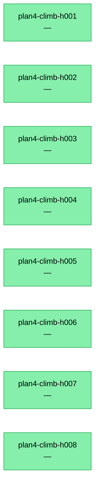

# Research Tree — climb cycle observability

> Generated by `tools/climb/regen-tree.py` (deterministic — 8 runs logged)
> Do NOT edit — re-generated on every push / LB landed / cycle complete.

**SOTA**: —

## In-flight / session state (dynamic — resume reads this, then verifies liveness)

- **phase**: Plan 4 complete
- **last_cycle**: 8
- **next_hypothesis**: None
- **in-flight**: none

**Next action on resume**: Await operator direction for branch integration.

## Paradigm calibration matrix

| paradigm | n | mean_gap | std | last_3 |
|---|---|---|---|---|

## Push ladder (chronological)

| run_id | paradigm | parent | local | online | gap | verdict |
|---|---|---|---|---|---|---|
| plan4-climb-h001 | plan4-task-1 | — | 1.00 | — | — | 🟢 confirmed |
| plan4-climb-h002 | plan4-task-2 | — | 2.00 | — | — | 🟢 confirmed |
| plan4-climb-h003 | plan4-task-3 | — | 3.00 | — | — | 🟢 confirmed |
| plan4-climb-h004 | plan4-task-4 | — | 4.00 | — | — | 🟢 confirmed |
| plan4-climb-h005 | plan4-task-5 | — | 5.00 | — | — | 🟢 confirmed |
| plan4-climb-h006 | plan4-task-6 | — | 6.00 | — | — | 🟢 confirmed |
| plan4-climb-h007 | plan4-task-7 | — | 7.00 | — | — | 🟢 confirmed |
| plan4-climb-h008 | plan4-task-8 | — | 8.00 | — | — | 🟢 confirmed |

## Mermaid push DAG

## Hypothesis pool

### Active (0) — ranked by priority

### Confirmed (8)
- H-001: Establish the complete portable DCI payload
- H-002: Replace shell launchers with exact DCI task bindings
- H-003: Move all DCI implementation and resources under the package
- H-004: Reduce the DCI CLI to an application adapter
- H-005: Remove global DCI benchmark orchestration and launchers
- H-006: Prove DCI first as an installed third-party distribution
- H-007: Materialize the identical payload as a built-in source form
- H-008: Close migration and repository boundaries

