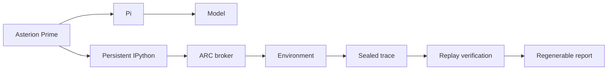

# Asterion README and ARC-AGI-3 Achievement Implementation Plan

> **For agentic workers:** REQUIRED SUB-SKILL: Use superpowers:subagent-driven-development (recommended) or superpowers:executing-plans to implement this plan task-by-task. Steps use checkbox (`- [ ]`) syntax for tracking.

**Goal:** Publish an accurate bilingual project introduction that explains Asterion's current architecture and presents one real, verified ARC-AGI-3 Level 1 solve with reproducible visual evidence.

**Architecture:** Keep `README.md` as the canonical English entry point and add a structurally equivalent `README.zh-CN.md`, both backed by repository-relative evidence assets. Generate the replay GIF only from the sealed run's normalized frames, preserve the supplied report screenshot without re-rendering it, and update GitHub repository metadata only after local documentation gates pass.

**Tech Stack:** Markdown, HTML image tags, Pillow, Asterion `arc-story` CLI, Python `unittest`, GitHub CLI.

## Global Constraints

- State only that Asterion Prime completed Level 1 of `ls20-9607627b` in one sealed run; do not claim that the project solved all of ARC-AGI-3, achieved a benchmark score, or matched another agent.
- Use these exact run facts: `deepseek-v4-flash`, 23 actions, 30 visual frames, 43 reasoning cells, score `3.267621`, one completed level, terminal level completed, sealed trace, and replay verification.
- State that token usage and elapsed time were not recorded for this legacy run; do not estimate either value.
- Treat Asterion Prime and Asterion Native as peers sharing the public Asterion framework; P1-P7 are applications, not the Prime foundation.
- State that the native Asterion Prime path uses Asterion's Pi integration and does not import or execute prime-agent source code.
- Keep Pi, credentials, datasets, generated private evidence, and legacy/reference source trees external.
- Do not expose prompts, private worker text, credentials, provider payloads, local absolute paths, or hidden chain-of-thought.
- Do not rerun the model or ARC environment during this documentation change.
- Preserve all unrelated modifications already present in the dirty worktree.
- Use the exact GitHub description, website, and topic set approved in the design specification; change no other repository setting.

---

### Task 1: Add Real ARC-AGI-3 Documentation Evidence

**Files:**
- Create: `docs/assets/arc-agi-3/solve-replay.gif`
- Create: `docs/assets/arc-agi-3/solve-report.png`

**Interfaces:**
- Consumes: the sealed run's normalized `data/frames.jsonl` and the operator-supplied `arc-agi-3-ls20.png` report screenshot.
- Produces: repository-relative assets used by both README files; the GIF is 384×384 and the PNG remains at its original pixel dimensions.

- [ ] **Step 1: Validate the source evidence before writing assets**

Run:

```bash
uv run python - <<'PY'
import json
from pathlib import Path
from PIL import Image

frames_path = Path("artifacts/arc-agi-3/games/ls20-9607627b/runs/p7-live-20260909065351/data/frames.jsonl")
screenshot_path = Path("/Users/sujiangwen/Desktop/arc-agi-3-ls20.png")
frames = [json.loads(line) for line in frames_path.read_text().splitlines() if line.strip()]
with Image.open(screenshot_path) as image:
    print({"frames": len(frames), "screenshot": image.size, "mode": image.mode})
assert len(frames) == 30
assert screenshot_path.is_file()
PY
```

Expected: the command prints `frames: 30`, reports the screenshot dimensions, and exits with status 0.

- [ ] **Step 2: Generate the replay GIF from normalized frames**

Run this exact one-off asset build; it writes only the binary documentation output that `apply_patch` cannot represent:

```bash
mkdir -p docs/assets/arc-agi-3
uv run python - <<'PY'
import json
from pathlib import Path
from PIL import Image

source = Path("artifacts/arc-agi-3/games/ls20-9607627b/runs/p7-live-20260909065351/data/frames.jsonl")
target = Path("docs/assets/arc-agi-3/solve-replay.gif")
palette = [
    "#000000", "#0074D9", "#FF4136", "#2ECC40",
    "#FFDC00", "#AAAAAA", "#F012BE", "#FF851B",
    "#7FDBFF", "#870C25", "#FFFFFF", "#39CCCC",
    "#B10DC9", "#001F3F", "#01FF70", "#85144B",
]
rgb = [tuple(bytes.fromhex(color[1:])) for color in palette]
records = [json.loads(line) for line in source.read_text().splitlines() if line.strip()]
images = []
for record in records:
    grid = record["grid"]
    image = Image.new("RGB", (64, 64))
    image.putdata([rgb[value] for row in grid for value in row])
    images.append(image.resize((384, 384), Image.Resampling.NEAREST))
assert len(images) == 30
images[0].save(
    target,
    save_all=True,
    append_images=images[1:],
    duration=[500] * 29 + [1800],
    loop=0,
    optimize=True,
    disposal=2,
)
PY
```

Expected: `docs/assets/arc-agi-3/solve-replay.gif` exists, contains 30 frames, uses nearest-neighbor scaling, and holds the final frame for 1.8 seconds.

- [ ] **Step 3: Copy the approved report screenshot without resizing it**

Run:

```bash
cp /Users/sujiangwen/Desktop/arc-agi-3-ls20.png docs/assets/arc-agi-3/solve-report.png
```

Expected: the source and destination SHA-256 digests match exactly.

- [ ] **Step 4: Verify both generated assets**

Run:

```bash
uv run python - <<'PY'
from pathlib import Path
from PIL import Image

gif_path = Path("docs/assets/arc-agi-3/solve-replay.gif")
png_path = Path("docs/assets/arc-agi-3/solve-report.png")
with Image.open(gif_path) as image:
    assert image.size == (384, 384)
    assert image.n_frames == 30
with Image.open(png_path) as image:
    assert image.width >= 1500
    assert image.height >= 1500
assert gif_path.stat().st_size > 0
assert png_path.stat().st_size > 0
print("ARC README assets: PASS")
PY
shasum -a 256 /Users/sujiangwen/Desktop/arc-agi-3-ls20.png docs/assets/arc-agi-3/solve-report.png
```

Expected: `ARC README assets: PASS`; the two PNG digest lines are identical.

- [ ] **Step 5: Commit only the visual evidence**

```bash
git add docs/assets/arc-agi-3/solve-replay.gif docs/assets/arc-agi-3/solve-report.png
git commit -m "docs: add ARC-AGI-3 solve evidence"
```

Expected: the commit contains exactly the two image files.

### Task 2: Rewrite the English README and Add the Chinese README

**Files:**
- Modify: `README.md`
- Create: `README.zh-CN.md`

**Interfaces:**
- Consumes: `docs/assets/arc-agi-3/solve-replay.gif`, `docs/assets/arc-agi-3/solve-report.png`, current runtime/provider manifests, and current CLI help.
- Produces: matching English and Simplified Chinese repository entry points with stable relative links and the English heading anchor `#arc-agi-3-interactive-reasoning`.

- [ ] **Step 1: Reconfirm the public commands and identities before writing claims**

Run:

```bash
uv run asterion --help
uv run asterion arc-story --help
uv run asterion arc-story compile --help
uv run asterion arc-story analyze --help
uv run asterion arc-story render --help
uv run asterion arc-story export --help
uv run asterion arc-story serve --help
uv run python - <<'PY'
from pathlib import Path

source = Path("src/asterion/runtimes/asterion_prime.py").read_text()
assert 'runtime_id="asterion.prime"' in source
print("runtime identity: asterion.prime")
PY
```

Expected: every help command exits 0, and the identity check prints `runtime identity: asterion.prime`.

- [ ] **Step 2: Replace `README.md` with the canonical English narrative**

Write the English README with this exact section order and claim boundary:

```markdown
<p align="right"><strong>English</strong> | <a href="README.zh-CN.md">简体中文</a></p>

# Asterion

Composable, multi-runtime infrastructure for building verifiable agent applications.

## ARC-AGI-3 interactive reasoning
```

The ARC section must include the replay GIF near the top; identify the result as one completed Level 1 of `ls20-9607627b`; present the eight approved facts in a compact table; explain hidden objectives, stateful interaction, online experiments, bounded actions, and environment-confirmed completion; and show this Mermaid evidence flow:



After the technical explanation, embed the report screenshot at restrained width:

```html
<p align="center">
  
</p>
```

Continue with these sections: `How the evidence is preserved`, `Architecture`, `Install and inspect`, `Generate an ARC solve report`, `External runtimes and resources`, `DCI reference product`, `Security and cost boundaries`, `Development`, `Promotion`, and `Compatibility and history`. Preserve durable operator guidance and links from the existing README, remove the brittle inventory-count snapshot, and label Prime Gateway as legacy/reference compatibility that is separate from native `asterion.prime`.

Use the verified `arc-story` signatures, including this regeneration sequence with symbolic, non-private values:

```bash
uv run asterion arc-story compile RUN_ROOT
uv run asterion arc-story analyze GAME_ID RUN_ID
uv run asterion arc-story render GAME_ID RUN_ID --analysis ANALYSIS_ID
uv run asterion arc-story export GAME_ID RUN_ID --render RENDER_ID
uv run asterion arc-story serve
```

Explicitly say that normalized facts, versioned analysis, versioned rendering, and standalone export are separate layers; the narrative is post-run evidence interpretation, not hidden chain-of-thought.

- [ ] **Step 3: Create `README.zh-CN.md` as a full structural counterpart**

Begin with:

```markdown
<p align="right"><a href="README.md">English</a> | <strong>简体中文</strong></p>

# Asterion

用于构建可验证智能体应用的可组合、多运行时基础框架。

## ARC-AGI-3 交互推理解题
```

Translate the complete English structure and technical meaning rather than shortening it. Keep IDs, commands, code symbols, metric values, file links, and trust-boundary terms exact. Use the same GIF and the same 620-pixel screenshot. State plainly that native Asterion Prime uses Asterion's Pi integration and does not import or execute prime-agent source.

- [ ] **Step 4: Verify structure, links, redaction, and claim parity**

Run:

```bash
uv run python - <<'PY'
from pathlib import Path

english = Path("README.md").read_text()
chinese = Path("README.zh-CN.md").read_text()
for text in (english, chinese):
    for required in (
        "docs/assets/arc-agi-3/solve-replay.gif",
        "docs/assets/arc-agi-3/solve-report.png",
        "ls20-9607627b",
        "deepseek-v4-flash",
        "3.267621",
        "23",
        "30",
        "43",
        "asterion.prime",
    ):
        assert required in text, required
assert "README.zh-CN.md" in english
assert "README.md" in chinese
assert "## ARC-AGI-3 interactive reasoning" in english
assert 'width="620"' in english and 'width="620"' in chinese
for forbidden in (
    "/Users/sujiangwen",
    "TemporaryItems",
    "3th-party/prime-agent",
    "chain-of-thought transcript",
):
    assert forbidden not in english
    assert forbidden not in chinese
print("bilingual README contract: PASS")
PY
make docs-check
uv run python -m unittest -v tests.test_prime_arc_agi_3_run_story
```

Expected: `bilingual README contract: PASS`; `make docs-check` passes; `tests.test_prime_arc_agi_3_run_story` passes without provider or model access.

- [ ] **Step 5: Inspect the rendered Markdown assets and commit the documentation**

Open both README files in the existing authenticated browser session or GitHub-compatible Markdown preview. Confirm the GIF is crisp, the screenshot is approximately 620 CSS pixels wide, the two language links work, no heading/link is broken, and neither page implies a complete ARC-AGI-3 benchmark solve.

Then run:

```bash
git add README.md README.zh-CN.md
git commit -m "docs: present verified ARC-AGI-3 solve"
```

Expected: the commit contains only the two README files.

### Task 3: Publish and Verify GitHub Repository Metadata

**Files:**
- No repository files.

**Interfaces:**
- Consumes: the verified English anchor `https://github.com/uukuguy/asterion#arc-agi-3-interactive-reasoning` and the authenticated existing `gh` session.
- Produces: exact GitHub About description, website, and topic set; no other GitHub setting changes.

- [ ] **Step 1: Confirm repository identity and authentication**

Run:

```bash
git remote get-url origin
gh auth status
gh repo view uukuguy/asterion --json nameWithOwner,description,homepageUrl,repositoryTopics
```

Expected: origin and `nameWithOwner` identify `uukuguy/asterion`; the active authenticated account is `uukuguy`.

- [ ] **Step 2: Set the approved About values and topics**

Run:

```bash
gh repo edit uukuguy/asterion \
  --description "Composable multi-runtime agent application framework with a native Prime runtime and verified ARC-AGI-3 interactive solving evidence." \
  --homepage "https://github.com/uukuguy/asterion#arc-agi-3-interactive-reasoning" \
  --add-topic agent-framework \
  --add-topic agentic-ai \
  --add-topic llm \
  --add-topic multi-runtime \
  --add-topic capability-system \
  --add-topic interactive-reasoning \
  --add-topic arc-agi-3 \
  --add-topic pi \
  --add-topic python \
  --add-topic typescript \
  --add-topic rust
```

Expected: command exits 0 and changes only description, homepage, and topics.

- [ ] **Step 3: Read back and assert the exact public state**

Run:

```bash
gh repo view uukuguy/asterion --json nameWithOwner,description,homepageUrl,repositoryTopics > /tmp/asterion-github-about.json
uv run python - <<'PY'
import json
from pathlib import Path

state = json.loads(Path("/tmp/asterion-github-about.json").read_text())
expected_topics = {
    "agent-framework", "agentic-ai", "llm", "multi-runtime",
    "capability-system", "interactive-reasoning", "arc-agi-3", "pi",
    "python", "typescript", "rust",
}
actual_topics = {item["name"] for item in state["repositoryTopics"]}
assert state["nameWithOwner"] == "uukuguy/asterion"
assert state["description"] == "Composable multi-runtime agent application framework with a native Prime runtime and verified ARC-AGI-3 interactive solving evidence."
assert state["homepageUrl"] == "https://github.com/uukuguy/asterion#arc-agi-3-interactive-reasoning"
assert actual_topics == expected_topics
print(json.dumps(state, ensure_ascii=False, indent=2))
PY
```

Expected: the complete returned JSON is printed, every assertion passes, and the topic set contains exactly the eleven approved values.

- [ ] **Step 4: Record completion without committing external state**

Append one concise entry to `docs/status/JOURNAL.md` through `apply_patch` identifying the README commit and the successful GitHub metadata read-back, then commit only that journal update:

```bash
git add docs/status/JOURNAL.md
git commit -m "docs: record README publication metadata"
```

Expected: local Git status still contains all unrelated pre-existing changes, and the final report includes the README paths, asset dimensions, passing commands, commit IDs, and exact GitHub metadata values.
