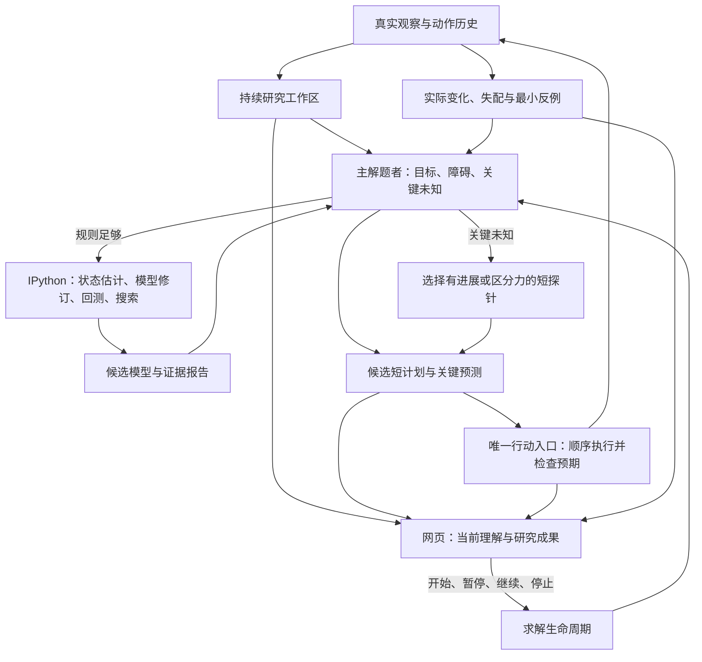

# P7 WorldMap 求解器与网页控制台：整体重设计

> 2026-10-05，用户确认继续实施的整体设计。实现与真实求解验收进行中；本文描述目标合同，不表示能力已验证。

## 1. 产品目标与设计选择

P7 是一个会研究未知游戏并用研究成果解题的智能体。它应从真实交互中形成可修正的 WorldMap，将有用的认识写成可计算的程序，通过推演找到路线，并在真实执行中检验和改进自己的模型。网页控制台让操作者看到这整个过程。

选择 **一个主解题者、一个持续研究工作区、一条预测驱动的行动循环**。复用 Prime 的持久 IPython 编程能力；不要求沿用现有 P7 工具列表、认知账本、类结构、机制 DSL 或搜索器。必要时由主解题者调用专注建模任务，仍保持一个环境动作所有者。

PNG、数字网格或两者结合属于感知选择，不是这次重设计的前提。核心能力是模型能操作真实证据、表达适合游戏的状态和规则、计算目标及路线，并从反例中修正。参考来源与当前实现诊断见 `docs/reviews/2026-10-05-p7-worldmap-solving-design-review.md`。

保留项目级边界：Python 编排；应用调用既有 runtime 与 runner；真实动作只有一个受控入口；观测是证据，程序预测和语言假说不能自行变成真实结果。本文不批准另造通用 composer、runner 或将应用知识写进框架模块。

## 2. 认知架构

### 主解题者

主解题者负责整个游戏目标与行动选择。每次收到反馈后，它回答：当前要完成什么，阻碍是什么，哪些规则足够可信，哪项未知会改变下一步选择，以及下一项计算或真实动作为什么有用。

它可以直接依据部分认知推进，不必先完成全部建模。对确定控制不重复试验；对影响路线的未知条件选择短实验；对已有可用规则调用代码推演、搜索和比较路线。完成一次建模后应实际使用模型，避免建模、记笔记和读工具持续占用循环却不解题。

### 专注建模任务

主解题者可在复杂规则、隐状态、反复失配或搜索困难时调用专注建模任务。它接收固定证据快照、当前目标/竞争假说和具体计算问题，返回候选程序修订、覆盖范围、反例、验证结果及可检验建议。

专注任务不派发真实动作，不直接替换当前模型。主解题者审阅并选择修订；工作区按版本串行接纳，避免两个任务同时修改当前程序或争用 kernel。默认单一 actor 在同一 IPython 中研究即可；增加专注上下文是按需能力，不是每步固定调用。

### 持续研究工作区

研究成果独立于模型聊天窗口存在。工作区保存原始观察、程序与状态、当前 WorldMap、证据摘要、开放问题、尝试反例和计划。工具应让模型直接读、计算、修改这些成果，而不是要求模型把每条认识翻译成一套预设机制表单。

Host 持有只追加的权威动作/观察历史。模型读取快照或副本并写派生结果；模型文件、stdout 和自述不能改写原始证据。控制台及回测都引用同一权威历史序号。

## 3. WorldMap 的含义

WorldMap 是当前可操作的游戏理解，包含以下相互关联的内容：

| 内容 | 用途 |
|---|---|
| 观察到的对象、布局、关系和当前状态 | 确定当下可以做什么 |
| 推断的隐状态和少量竞争解释 | 区分看起来相同、后续行为可能不同的状态 |
| 动作规律、条件、代价和失败风险 | 预测后继并判断路线可行性 |
| 胜利条件与当前子目标 | 判断进展，识别障碍与关键未知 |
| 当前模型的范围、证据与反例 | 判断哪里可演算、哪里需要短探针 |

稳定中文玩法介绍继续是主要可读视图，描述这是什么游戏、对象含义、控制、规则、目标及未知条件。它与程序模型共用版本关联和证据来源，不维护一份脱离计算和反馈的独立“确定真理”。程序模型的存在也不要求每句话都可执行。

置信度、实测支持与适用范围分别表达。一次移动成功只支持该条件下的动作效果，不能确认完整胜利条件、路线正确性或最短性。保留尚未确认但有规划价值的认识；反例能使适用范围缩小或候选模型被替换。

不同关卡共享机制，布局、资源、阶段和局部参数重新估计。RESET 重建当前尝试状态，过关建立下一关状态，进程恢复校准实际观察；三者不能混为“把所有理解清空”或“旧状态完全可续用”。

## 4. IPython 作为研究与规划引擎

### Prime 与 P7 的职责

`asterion-prime` 提供通用持久计算工作区：kernel 执行、串行调度、有限计算、取消、代码/数据工件与显式恢复。P7 经由这一框架能力编程，拥有游戏证据接口、WorldMap、模型/搜索代码、目标与计划；真实环境动作仍由 P7 Broker 唯一执行。通用 Prime 模块不解释游戏规则，不依赖 P7。

当前执行实现位于 P7，实施时提取可复用的计算生命周期，保留应用 bootstrap 与证据适配。现有 compaction 能保留 kernel；完整进程恢复仍需实现显式工件合同，不能宣称任意 namespace 已能恢复。研究 worker 不继承动作 bridge 的文件描述符或凭据，只接只读证据服务；这属于能力路由隔离，不是同 UID 任意 Python 的操作系统沙箱。

模型可选择适合游戏的抽象状态，并逐步实现状态估计、转移、观察投影、目标判断、候选动作、子目标、启发式和专用搜索。状态可以包括开关、库存、计时、选择模式、屏外地形和历史变量，不能限制为整张像素图加关卡号。

这些是可用的编程约定，不是进入求解前必须全部完成的闭合协议。早期只会模拟移动也能搜索一个接近目标或检验碰撞的子目标。不能解释的变量和状态明确为 unknown；代码能保留少量候选模型并比较预测。

研究工作由问题驱动，例如：

- 从历史差分估计一次操作移动了哪些对象，有没有条件依赖。
- 让候选转移解释已观察的动作，找第一个反例并判断漏了状态还是规则错误。
- 对当前模型搜索达到一个子目标的路线，比较动作数与风险。
- 比较两项目标假说在哪个最短探针上预测不同结果。

模型代码、数据、当前状态和验证报告可读且可修订。持久 namespace 减少重复工作，纯程序产物保证聊天压缩或 worker 重建后研究可继续。只恢复纯模型/分析代码、数据和已分析历史序号，不重播含真实动作的 cells；随后用真实当前观察校准。

计算预算由应用设置有限值。长搜索应分块保留 frontier、输出简短进展，而非执行超长 cell 或输出完整空间。超时只说明计算未完成，不说明无解。基础实现可用纯 Python；可用数值库按实际打包环境声明。

## 5. 检验、规划与纠错

### 模型检验分三层

1. **状态与观察投影**：对象是否识别正确，隐状态是否足够，模型声称覆盖的区域能否对应真实观察。
2. **转移规律**：给定该状态和动作，已声称的后继是否符合历史；保留未覆盖部分与最小反例。
3. **目标与终局**：目标谓词是否与真实过关/失败证据一致；没有终局证据时仍是目标假说。

模型动态回测正确不能顺便确认目标；搜索在错误 outcome 下找到路线不能宣布真实游戏可赢。覆盖范围记录适用关卡、状态区域、动作和反例；高验证分数不能掩盖只覆盖很小一部分。

### 两类规划协作

**推进目标**：利用足够可信的规则完成子目标，程序计算路线与关键预测。

**减少关键不确定性**：当未知条件影响路线时，选短探针区分候选规则、目标或隐状态。考虑预期进展、信息收益、动作成本、风险与可恢复性；没有真实计算依据时不显示伪精确的信息增益数字。

搜索进入未覆盖区域应返回“不确定前沿”和所依赖假设，供主解题者决定是否执行短探针。规则不完整不等于只能盲试；已懂的部分继续用于计算。一次普通动作可同时推进目标与检验多个相关假说，不为每条假说强制安排独立实验。

### 预测驱动的行动循环

计划由主解题者明确提交，包含当前起点、模型版本、目标、动作序列、关键预期和未确认条件。分析代码只能产生候选，不能自行 dispatch。

新工具面分为研究计算与独立计划提交。研究 cell 只注入证据读取/计算接口，不携带动作提交凭据；真实行动授权位于主解题者的提交入口，由 Broker 核对。不能只靠 prompt 阻止自由 Python 直接调用动作 API。它仍复用同一 Prime/runtime/kernel 与唯一执行链，不新建 runner。

行动端顺序执行短前缀，每步记录真实结果并检查预期。关键失配、关卡/终局变化、动作不可用或暂停请求使剩余后缀停止。第一次失配反馈给主解题者：预测什么、实际发生什么、哪个模型和状态被使用、哪些后缀未执行。

主解题者定位状态估计、规则、目标或代码错误，保留反例，再修订、回测或选探针。候选模型分支和旧版本可回退，失败修订不覆盖可靠成果。旧模型、旧观察或新关卡不能继续消费原计划。

完整模型证书不是所有探索动作的通行证。现有受认证 DSL 可以作为一个模型实现保留，也可在新设计中移除；它不再限定智能体能表达的全部世界规律。证据检查约束真实计划，不能把合理的假说推演与外部真实引擎搜索得到答案混为一谈。

## 6. 网页控制台是求解过程的共同观察面

控制台与求解器使用同一条事件时间轴和模型版本。它不是另一个求解者，也不由前端猜测后端的推理状态。

### 页面工作区

| 区域 | 默认内容 | 操作者可做什么 |
|---|---|---|
| 游戏画面 | 当前真实帧、对象标注、当前目标位置；模型预测使用独立标识 | 看当前帧、按事件回看、比较预测与实际 |
| 当前求解任务 | 当前目标、障碍、关键未知、下一计算/动作及简短依据 | 判断是否在推进、查看对应证据 |
| WorldMap | 稳定中文玩法介绍、当前状态、关键规则/目标假说、修订摘要 | 查看认识如何改变，按需展开证据范围与反例 |
| 研究与计划 | IPython 任务、回测/搜索摘要、当前模型版本、候选计划及假设 | 看计算是否完成、计划为何可信或需探针 |
| 行动反馈时间轴 | 决策、计算、计划、真实动作、失配和修订的连续链 | 定位导致某项认识改变的动作和观察 |

默认突出当前任务、画面和认识，详细计算与证据渐进展开。长计算显示明确阶段、真实开始时间、可用的已完成工作量和停止入口；没有可计算总量时不制造百分比。认知条目数量不作为进展指标。

候选画面和模拟轨迹始终标为预测，不混入真实帧档案。计划显示哪些已执行、哪些未执行、为何停止。某个假说被推翻时，页面能链接到对应的预测、真实变化和修订版本；这些是公开结果与依据，不展示私有思维链。

### 来源明确的事件

事件覆盖观察、公开决策、计算开始/结束/失败、模型修订、验证报告、候选计划、动作结果、失配和生命周期。每项记录明确关联 run、attempt、level、观察序号、任务/计划标识和模型版本；允许缺失关联，但不补造。

三种内容明确区分：**模型声明**（当前目标/假说）、**计算结果**（指定程序版本的回测/搜索）、**真实观察**（环境动作及返回状态）。计算完成不等于关卡完成，模型自述“确定”不等于实测已证实。

实际计算生命周期来自 operator/IPython 的调用边界。计算类别和目的来自明确声明；不能根据 stdout 猜测“正在搜索”。缺少结束证据显示中断或未知。页面不直接暴露 provider payload、prompt、任意 stdout、私有路径或完整分析代码；需要检视程序时由独立受控研究工件入口处理。

历史回看冻结当时的画面、目标、WorldMap、模型版本、计划和证据，不用最终认识覆盖早期状态。历史视图只读；独立的全局停止入口仍针对当前真实运行。现场、回放和离线导出复用同一投影规则。

### 操作与运行状态

操作者获得开始、暂停、继续、停止和回看。求解工作阶段与进程生命周期分别显示：正在计算不是卡死，已请求停止也不是已清理。

暂停停止新派发，允许已派发动作返回并记录，然后保存一个真实边界。继续先核对当前观察、模型版本和待执行计划；不匹配就重新规划。停止终止运行并确认 owned processes/guest 清理。有限应用控制不因反复暂停或恢复被无限延长。此处定义新设计目标，当前取消功能不能因此改称暂停已实现。

计算中的暂停请求立即阻止新行动，当前有界 cell 完成或主动让出后才进入 paused；此前显示 pause-requested。停止可取消当前计算，并记录 interrupted；不能假定尚未落盘的搜索 frontier 已保存。

人工试玩、存档与回放继续独立。人工动作不进入 P7 的模型证据和经验；本设计不默认授权人工向自主局注入答案或路线。未来若加入人工建议或接管，应单独标来源并使相关旧计划失效，同时与自主能力评估隔离。

## 7. 对当前实现的处置

不以兼容现有类和工具为设计目标。实现时依据职责决定保留、重写或删除：

- 复用已有 Prime/IPython 的执行能力，以及真实动作、身份和历史证据边界。
- 用持续研究工作区与统一求解状态替换分散、反复注入的知识协调流程。
- 将模型自由编程、历史回测、目标与路线搜索提升为默认能力，取消其仅为 fallback 的策略定位。
- 重做应用工具面，使自动观察/反馈和少量真正有用的计算/行动入口支撑整条循环；不保留仅服务旧账本操作的工具。
- 将 console 的阶段、模型、计划和纠错事件与新求解循环共同设计；已有实时展示与 HUMAN 资产按契合度复用。
- 受限 DSL、自动归纳和现有 stores 若保留，只作为明确的模型/证据实现，不能继续决定所有游戏的表达范围。

用户确认继续后，`D-2026-10-05-01` 修订了 `D-2026-10-01-01` 的 DSL-only planner 选择；实际代码迁移由实施计划跟踪。保留的原则是当前证据、预测检查与唯一真实动作入口，而非有限规则表本身。

## 8. 整体验收与实施范围

验收是连续的自主求解故事：未知游戏 → 形成工作模型 → 用证据修正 → 程序计算路线 → 实际兑现预测 → 遇到反例继续求解。控制台必须能复原同一故事。

首个能力检查使用全新本地游戏和固定应用预设，不载入精确成功路线、不使用人工动作或真实 SDK 离线搜索生成答案。保留全部动作、RESET、时间与停止原因。记录模型程序如何改变下一动作，而非只统计调用次数。

随后检查下一关机制迁移，以及复用认识/程序而不复用精确动作路线的再次求解。真实胜利状态和动作效率是结果；语言描述、回测、synthetic tests 和 UI 检查只是各自边界内的证据。

实现作为一个共同验收的重构包：求解控制循环、研究工作区、模型计算与证据、动作反馈、控制台事件及交互同时闭合。开发可按依赖分工，但不能只交付工具、prompt 或页面片段便宣称完成。

工具变更须同时更新 TypeScript 注册、打包扩展、Python bridge、allowlist、prompt 与针对性测试；跑扩展/Python/打包检查，再走有限真实 wheel 运行并记录结果。全仓既有失败单独标注，不能隐去，也不能让无关门禁代替求解验收。

本设计来自源码比较与用户目标，尚未被新的真实求解评估证明。它允许整体替换实现，但不构成 25 游戏全量复现或无限模型运行的授权。

## 9. 首次实测后的主路径补充合同

首次 fresh SP80 L1 的真实通关证明了行动闭环，但该次运行没有 IPython 计算或 WorldMap 发布，不能证明持久模型参与了行动选择。因此把语言 WorldMap 修订变成低成本的主路径，不用强制无用计算补齐调用次数。

在同一个 `p7_workspace` 增加 `revise`：直接提交当前语言 WorldMap、任务、证据和修正，生成不可变子版本。它继承程序源码、状态与报告的原证据含义，不运行代码、不接纳自报验证结果、不赋予模型声明环境事实地位。程序建模与计算产物继续使用现有 `publish` 路径。

初始真实计划必须引用具有非空游戏描述和当前目标的语义版本，并关联当前真实观察；未知规则、未知目标细节和竞争假说都允许，不要求完整模型、程序或认证。初始 probe 没有特殊绕过入口，因为直接 `revise` 已足够轻量。匹配成功的计划可以继续复用版本；预测失配、实际 RESET 或过关换图后，下一段计划前必须完成一次关联当前证据的修订。一次修订可处理多项认识，不逐动作或逐假说强制实验。

语义修订门槛与 kernel 恢复校准分别记录。同一次有效修订可以满足两者，但必须是实际可用的 kernel，且修订不能使真实 `kernel.lost` 或环境结果 unknown 变为正常。环境结果 unknown 仍禁止再派行动；恢复计算工作区不能恢复未知的环境动作。

因果关系沿用计划的 `workspace_revision`、`goal`、`assumptions` 和版本的证据、修正及真实反馈，不增加另一套 basis 标识或调度循环。验收观察认识怎样影响计划、遇到反例怎样修订及跨关怎样复用；修订次数和 IPython 调用次数均不是求解能力证明。

## 10. 已授权的显式保存进度接续

用户在已过两关后明确要求从第三关继续。默认fresh行为保持；接续仅接受本次进程显式声明的精确source run，不由历史配置自动启动或择优选择。应用调用exact prefix loader复用封存/summary/身份/trace及真实replay验证，再由既有Broker逐条恢复保存动作，完成后模型直接看到当前第三关。无新runner、工具、协议或SDK内部level跳转。

接续保留verified研究三工具和新的Prime namespace；仅验证后读取来源WorldMap五个语义字段作为待复核先验，不复制报告认证、模型artifact或checkpoint。新的workspace仍需针对当前证据修订。source run当前为p7-live-20261005221958-e3d73e5ff66547bc9a6ff731，sp80-589a99af/seed0/gpt-6.1-sol/完成2关。任何来源身份、文件hash/symlink、封存/replay或实时恢复失配均拒绝接续，不回退fresh或legacy。

来源16动作恢复与新求解动作分别记录，完整receipt/replay仍含全部真实动作。start_level=3,fresh=false；恢复失败按已实际执行数记录，禁止进入模型求解。目标L6总cap=16+sum(L3..L6人类baseline)=437，既有guest900s固定；这是真实warm接续，不能用作fresh/冷启动成绩。Console默认持久写该run/p7-console.html，控制台和状态记录保存已过关来源、恢复与后续求解的证据。

## 11. 已授权的25游戏总览、本地评分和网页续关

用户要求console覆盖25游戏过关与回放，并给出官网样式总统计与本地评分。主页顶部显示本地RHAE保存路线分数、已完成游戏/总游戏、已完成关卡/总关卡及实际动作；游戏目录逐项显示进度、分数、当前状态、已保存路线与各次回放。目录来自已验证metadata，不执行游戏源码；当前本地目录25游戏/183关，不硬编码数量。总览按固定model/seed/catalog划分，默认gpt-6.1-sol/seed0，避免把不同模型的成绩混在一起。

计分复用现有`partial_game_score`，但分母始终是整场游戏全部关卡，不能按某次witness目标计出虚假100分。每关效率为人类baseline/模型动作的平方，上限115%，按关卡序号加权，再以已过关权重限制游戏上限；固定目录全部游戏平均，未尝试计零。官方依据：[ARC RHAE methodology](https://docs.arcprize.org/methodology)。标记为本地最佳保存路线成绩；warm恢复和多次研究择优不伪装官方冷启动成绩。

只有身份/封存hashchain/summary/完成prefix一致且已记录replay确认的结果计入保存成绩。读取缓存只改善展示，不能授予执行权限；网页启动仍交给已有operator重新严格验证与真实恢复。游戏优先较高已过关数、同进度较少路线动作，再稳定run ID；当前失败关的动作不能混入成功prefix，但实际总开销必须保留。实际动作总数包括各次尝试与恢复，另列恢复/新增分账，不用成功路线长度替代整个attempt。

提供轻量`/api/overview`而不在每次轮询构建全部回放或重新运行engine。每游戏可选择回放；活动外部CLI运行只读跟随更新，没有console拥有的pause/stop权限。切换run取消旧跟随；用户查看历史cursor不被轮询强制拉回未来。离线HTML仍自包含并零网络，不编造全目录实时数据。

网页运行入口接受明确game/整场target/exact resume run。默认继续该游戏有用的保存进度；没有可恢复来源时显示从头开始，不悄悄使用旧路线或失败时回退。已全过的游戏不自动再跑。原manual与已拥有session暂停/继续/停止保持。ambient resume/history配置清除，只由本次明确选择设置verified路径；绝不新增runner或工具机制。单次继续沿用900秒有限预设。

后台求解另按用户指令：同一阻塞关卡两次未通过，封存进度并换游戏。已通过关卡不计失败；新关重新计数。只维持一个有界guest，不启动25游戏同时执行或全量benchmark。页面展示25项和统计本身不授权全量复现。

### 11.1 实施状态与当前运行约束（2026-10-06）

Console roster/filter and local selection follow the contract above: only exact WorldMap P7 runs with `gpt-6.1-sol`/seed 0 are eligible; legacy `dc22`/`vc33` history and actions are excluded. Tie-break is completed progress, RHAE, then fewer actions. Display denominator is the whole game; unplayed games contribute zero to the local 25-game average. Exact current implementation evidence and launch metadata are in `docs/status/RESUME-NEXT-SESSION.md`.

The user has since explicitly authorized sequential local solving over the catalog, DC22 then VC33 then remaining games, skipping completed SP80. Run one finite guest at a time. Two failed attempts at one blocked level trigger a game switch; success resets that level's failure count. Separately, exactly one complete 25-task official submission is authorized after finite DC22/VC33 attempts: pause remaining local games, record official score/channel, then resume. This is not authorization for repeated or open-ended livebench. Earlier wording that the 25-game sweep was unauthorized is superseded.

### 11.2 后续官方提交的明确边界（2026-10-06）

DC22 的当前 fresh run 因 `_CallbackRejected` / `prime-event-type` (`pi.prompt`) 中断，14 actions、0 completed levels、5 cells；cleanup true，但未封存/未 replay。分类为 runtime interruption，不计作求解失败，也不得在运行链路修复前重复启动。零关失败经验复用尚未接通，root 正在准备对应合同。

用户另行明确授权一次完整 25-task 官方提交：先结束有限 DC22/VC33 尝试（不论是否全通），暂停其余本地题；由 root 执行并记录官方分数及提交通道后，再继续其余本地题。该授权只限这一轮完整提交，不延伸为重复或无限 livebench。

## 12. 已授权的跨尝试经验复用：失败、程序与纠错

用户要求失败经验也完整积累，使 P7 再次求解时实际使用之前的研究。本节将 §10 的“只读取接续成功路线来源的 WorldMap”扩展为独立的经验输入；成功路线恢复仍遵守原来的严格封存与 replay 合同。本节为已授权实施合同，能力结果仍须真实运行验证。

### 12.1 两种来源分别选择

`resume_run_id` 只选择真实环境恢复路线。经验按精确 `game_id/seed/win_levels/model_id` 与新版 WorldMap P7 身份选择；默认读取最新合格经验，同时保留其他尝试的索引。选择较旧成功 prefix 时也必须读取后续失败研究；从头开始、零关失败和同关重试均使用经验，不要求先取得 `VerifiedPrefix`。当前默认仍为 `gpt-6.1-sol`、seed 0，旧 dc22/vc33 求解栈、人工试玩、其他模型/seed、其他游戏不进入经验池。`fresh` 表示环境从头开始，不能表示无经验冷启动；诊断另记实际经验来源。

方案选择：采用现有 run 目录上的应用级只读经验层。仅扩充成功 prefix 先验会继续丢掉失败与新尝试；新建通用知识库或 runner 会重复持久化与执行职责。因此复用 `ResearchWorkspace` 的不可变 revision、已接纳 exports、现有 trace 与 Prime kernel，把跨 run 选择、冻结和消费回执留在 P7。

### 12.2 来源与信任合同

每次启动在显式本地 runs root 下建立有限、确定的来源快照；只读取直接子 run、精确 scope 路径和已引用工件，不跟随 symlink，不允许模型提交任意路径。来源必须同时满足 trace 的精确 model/application/runtime 身份、research scope 的精确 game/seed/win_levels/run/attempt、revision 内容 hash 与父链、被引用 export 的 scope/kind/content hash。已有 summary 若存在须一致；缺 summary 本身不排除失败研究。禁止沿用 legacy model fallback。

信任是独立字段：`integrity=checked` 表示本地文件身份及内容完整；`trace_status=sealed_replayed|sealed_unreplayed|unsealed_prefix` 表示实际证据边界；`outcome=completed|failed|interrupted|unknown` 由已有真实证据决定。未封存不伪装已 replay，hash 也不证明游戏规则成立。无法确认结束时标 unknown，不能从文件存在或进程缺席推断完成。

无 finalizer 的运行可以读取 hash chain 中连续、完整的已记录前缀及已落盘研究版本。残缺最后一行只截断到前一完整记录，链中间非法即拒绝该来源；没有返回结果的动作标 unknown，不生成 action result。研究中的超界 evidence 引用必须显式记为 unresolved，不能冒充已经返回的环境证据；仍可保留其语言假说。revision/export hash 或身份冲突则拒绝对应来源/工件，记录安全原因码，不默默把旧版本称为最新版本。

来源在消费时固定 `source_run_id/source_revision/trace_head_sha256` 与工件 ID；读取返回复制值。既有运行只读，当前 run 原子保存一份有限经验 manifest 和实际消费记录，使后续源文件增长不会改变当次已读内容。后续显式查询若源文件被替换或 hash 变化则拒绝，不能读取更新后内容并继续沿用旧引用。没有可用来源时正常从空经验开始；这与显式路线恢复失败的 fail-closed 行为分别处理。

### 12.3 保存什么、如何读到

经验是有来源的候选认识：WorldMap 的描述/规则/未知/竞争假说、原任务与未解决问题、`correction.changed/retained`、实际动作反馈与最小反例引用、已显式导出的模型源码及有限 JSON 状态，以及普通 IPython cells 的私有静态源码与执行元数据。原任务目标和预算只描述原运行，不能覆盖本次目标/预算。否定假说保留“在什么条件下被哪个反馈反驳”；中断只记录运行中断，不能据此把游戏假说判错。旧报告可供诊断，但其验证状态不传播到本次模型。

不依赖退出时摘要：每次现有 `revise/publish/checkpoint` 和真实动作记录仍立即落盘，下一次直接从这些持久工件重建经验。零动作但有语义修订可贡献未验证假说；零 exports 明确显示无程序可恢复；两者都没有则只有运行结果元数据，不生成虚构经验。

应用 IPython execute 入口在派发前原子存储有限 `call_id/generation/source/source_sha256`，返回后追加 execution status、有限结果元数据和显式 export IDs。进程未返回则保持 unknown/interrupted；失败、部分输出和 stdout 均不升级为环境事实。源码按既有每 cell 16 KiB 上限和明确每 run 总量保存，超限记录 omitted；失败 cell 同样保存。旧运行可从完整 hash trace 的精确 IPython tool call 提取源码为 candidate，并关联结果是否存在；trace 无原文就显示 unavailable，不推测恢复。如此不要求模型当时记得 export 才能留下程序研究；这些源码始终是 inert candidate，与可恢复的已接纳 export 分开。

启动自动把最新合格经验的紧凑内容与来源索引加入实际 actor 初始上下文和 `p7_workspace.read` 返回值，并保存所注入内容的 digest；不止在 prompt 中要求“记得以前失败”。自动材料优先包含最新纠错/反例，再含稳定规则、未解决问题、程序清单和来源状态。初始经验预算最多 16 KiB；若需要缩减，明确 `truncated` 和省略计数，不能丢弃来源与信任标记。总 actor context 仍服从既有 56 KiB 上限。

跨尝试细读扩展现有只读 `p7_research` bridge：按冻结的 source ID 分页读取研究版本、历史、帧与已接纳工件，禁止任意目录和写入/行动方法。每页历史最多 32 项，单响应服从既有 1 MiB 上限；来源发现、版本与字节扫描也须有显式有限上限和截断状态。所有合格尝试保留索引并可分页读取，不只记最佳或最近成功一次。当前运行的 `history/frame` 与 `evidence_sequences` 仍保持原语义；旧来源序号必须连同 source run 使用，不能转换为当前真实证据序号。

### 12.4 程序和状态的实际复用

自动接纳的源码与 JSON 默认是静态研究工件；可进入显式恢复集合的只包括原 `publish/checkpoint` 明确引用且 hash/scope/kind 一致的 exports。普通 cells 可作为 inert candidate 查询、审阅与改写，但不能进入自动恢复集合；stdout、聊天代码、pickle、namespace dump、旧计划与动作队列不参与恢复。Prime 继续唯一拥有 kernel、有限计算、取消及通用 source/JSON 恢复；P7 只持有证据读取、工件选择与当前游戏校准。

当前 actor 可通过原 IPython 读取旧源码/JSON，选择复用模型定义或重新编写，再在当前 namespace 导出并 `publish`；必须记录被读工件和新的 source export 关联。历史状态只能作为 `prior_state` 待检查，不能覆盖当前真实观察；旧 frontier 和计划不自动续跑。读取源码不会自动执行。若接到既有 `Prime.restore`，必须由当前 actor 显式选择已接纳 exports，遵守 fresh kernel 与 source/JSON 限制；禁止启动时以“恢复经验”为由无条件执行旧文本。此路径不新增动作工具、通用 runner 或 P7 专用 kernel。

经验输入不复制旧 workspace revision 作为本次 current revision，不带入证书、报告验证结论、计划 ID、kernel generation 或环境执行权。本次仍需用当前真实观察完成 `revise/publish`，失配、RESET、换关与 kernel lost 的既有门禁保持。从旧研究读出的反例可以帮助选探针，但不能满足当前证据校准，也不能洗白本次 unknown action result。

### 12.5 实际消费与控制台

区分 `available`（发现）、`loaded`（内容已送达 actor）、`read`（具体历史/工件查询成功）、`revised`（本次修订关联来源并保留/修正）四个事实。`loaded` 不等于模型采纳，`read` 不等于程序执行，导入数量不等于解题改进。保存当前 run、来源 IDs/hash、消费种类/有限计数、关联的新 revision 和纠错；程序只有实际重新导出并关联来源后才记 reused，不凭工具名称或自然语言声称判定。

控制台默认展示当前/最新运行的真实经验来源、信任状态、已加载/已读取、程序复用与新纠错；历史 cursor 固定当时记录。安全投影仅包含 run/revision/工件 ID、计数、状态与已允许公开的研究摘要，不显示私有路径、完整源代码、原始 stdout 或 provider 内容。总览的最佳保存路线与最新经验来源分列，失败零关仍可显示“有研究经验”，不因此增加通关分数、resume eligibility 或恢复权限。离线回放使用同一投影。

### 12.6 验收与当前未完成边界

针对测试覆盖：零关未封存失败被实际加载；无 finalizer 与最后一行截断；零动作/零 exports；跨模型/seed/game/legacy 拒绝；hash/symlink/超限与 unresolved 证据；较旧 prefix 加最新失败经验；同关 fresh 重试；旧序号不冒充当前证据；旧计划/证书无权；源码仅静态加载、显式当前计算后再发布；来源和消费回执在 UI/离线中一致。研发重点是代码变更审查与这些边界，无需穷举每种损坏组合。

真实有限尝试必须保存“来源 manifest → actor 实际收到的先验 digest → 指定历史/工件读取 → 本次 revision/纠错 → 新计划与实际反馈”的证据。没有 exports 时允许只证明语言/反例经验消费，明确程序复用未验证；不能为了完成指标伪造程序或强制无用计算。一次尝试只证明读入和使用，不足以证明动作效率提升；“越玩越熟练”需要后续同条件运行结果支持。当前 dc22 中断已有研究版本可供本合同恢复，但本节写入时尚无新的端到端消费证据。

### 12.7 当前实现与证据状态（2026-10-06）

Failure-experience implementation is committed as `12542476`: focused tests 37 PASS, joint checks 43 PASS, and an inert subprocess regression PASS (computed result 42). This verifies bounded loading and source boundaries, not guaranteed solving or automatic program execution. Complete-25 official preparation is committed as `c261633c`; preflight has 25 exact task IDs, but no card was opened and no submission occurred.

At the earlier 37-action checkpoint, DC22 run was `p7-live-20261006005914-31079cf165a443c496c180a1`, active at 37 actions after entering Level 2. Its revisions consumed negative hypotheses and retained evidence-backed movement/discard-click assumptions. The prior run has five missing cell sources, while its semantic/history evidence was loaded; the new run archive contains six cells and four exports. That checkpoint preceded the sealed 79-action / two-level outcome in the current session checkpoint. Console acceptance is complete; commits remain on `feat/p7-live-console` pending root integration to `main`, which the user prefers to happen promptly after closure.

### 12.8 DC22 sealed attempt and remaining runtime boundary (2026-10-06)

DC22 run `p7-live-20261006005914-31079cf165a443c496c180a1` ended at 79 actions, 2/6 levels, with trace seal, replay verification and cleanup true; guest inactive/MainPID 0. Action 79 completed L2. Although feedback labels the transition L3, the actor did not attempt L3; do not count an L3 reasoning failure. Observed experience included consumed negative hypotheses and retained movement/discard-click assumptions. This demonstrates consumption in that run, not guaranteed improvement or executable program restoration.

The callback path remains unresolved: event 271 `compaction_start` followed 270 `turn_end` and preceded `agent_end`, but the prior handler at 986 requires `agent_end`; `prime-native-callback` at `pi.prompt` still rejects this in-turn compaction sequence. Sol owns the fix/tests. Do not launch the next witness until root validates a new wheel. Root polish has 32 tests PASS; the omitted-counter/no-finalizer behavior is covered, but this does not mean all lifecycle/corruption cases passed.

`ca471c31` implements the observed in-turn/pre-prompt compaction fix (82 native checks PASS); `3c1869ea` completes source-omission visibility and public experience timeline facts; `670ff905` preserves partial replay seed identity. Related ordered checks: 256 PASS. Final promotion, main integration and real continuation are tracked in `RESUME-NEXT-SESSION.md`.

### 2026-10-06 live-console follow-up closure

Local main now includes completed WorldMap/experience/console work, generic live/finalized per-level cognition provenance (`b074b5f4`/`ebc4542c`), and refresh-safe playback (`002f37a0`). Final full promotion PASS25 commands, related Python205 PASS, DOM86 PASS/one existing skip, actual served-HTML cognition21 checkpoints PASS. Chrome visual acceptance remains external-limited. DC22 is sealed/replayed4/6 (197 actual/191 completed-prefix actions); L5 attempt2 is active. Keep the two-unfinished-attempt rule and the one official25-task submission gate after finite DC22/VC33. The recovery checkpoint owns current processes, attempts and evidence limits; earlier pending-main/held-launch addenda are historical.

## 2026-10-06 per-level attempts and efficiency retries

Latest user authorization supersedes earlier single-guest and whole-game900-second presets for the background campaign: at most two independent games; each witness targets only the next unsolved level and receives900seconds. Exact saved actions restore the previous levels without model re-solving. A passed prefix is sealed/exported before the next level starts with a new timer. Two genuine unfinished attempts at the same blocked level switch games; infrastructure failures require repair.

A saved level with actual actions >= its canonical baseline and per-level score <115 enters one persistent efficiency task. Equal baseline yields100 and therefore qualifies. Use the same verified source/experience; L1 starts fresh, later targets restore only through target-1. Preserve the original, admit only strictly improved target score, and validate existing later actions through the SDK. Tasks are prioritized after the current same-game attempt settles, without waiting for whole-game completion. Preserve the current saved highest level with a native partial or complete suffix; a retry at that highest level admits its new native prefix directly. Run tasks in ascending level order. Announce a new game by ID, starting level and concurrent partner. No paid re-solving of saved later levels and no repeated efficiency attempts after a genuine outcome.

The live console derives provisional completed levels from validated current action records, refreshes the overview when progress increases, and labels pending sealing. Saved-route scores/actions continue to use independently verified prefixes. Current deployment/check commands and owned process identities belong in the live recovery checkpoint.

## 2026-10-06 common console source and interruption contracts

At each selected level, frames, actions, decision events and cognition bind one source: current recorded observation, an SDK-verified saved source, or a real initial preview. The rail may show authoritative saved progress beside current-attempt actions, with both labeled. Saved authority must match the current exact best-run ID; older retained views are historical while replacement loads. Redo and ordinary polling cannot erase later saved levels, relabel earlier cognition as current evidence, or silently change the playback source. Async replies remain fenced by game, run, level and selection generation. Preview fallback applies to any missing level, including live/attempted games, and never promotes completion.

Only actual trusted process cancellation with every action acknowledged can freeze an active broker as interrupted. Replay checks every transition and unfinished terminal state; uncertain actions and ordinary model errors retain their existing rejection. Such failure can preserve bounded advisory research, but cannot publish a successful receipt or fabricated progress. An independent audit of an older unsealed record does not mutate or certify the original runtime. Current deployment and named checks belong in the live checkpoint.

## 2026-10-06 authenticated animation replay

Replay authenticates the original full observations against every unchanged before/after trace hash. Fresh SDK observations must match all metadata, settled final grid, frame count and every frame shape. Only intermediate pixel values may vary. Missing full witnesses retain strict full-hash matching. Native restoration records fresh actual hashes; separate offline recovery preserves the original native receipt and source file hashes. Cognition attribution requires both authenticated source and destination observations; source hashes and provenance remain intact. This contract applies to broker verification, saved-prefix restoration and official replay. Saved-route suffix composition remains strict full-hash replay; randomized-animation suffix composition is not established.

LF52 isolated SDK proof passed64 actions, saved levels [8,56], exact loading, L3 restoration, offline official executor and cognition2/11 with no warnings. Formal production recovery also passed as `p7-live-20261005234607-e8bf66a0006b47c009669913`; immutable original hashes and exact admission are recorded in the active checkpoint. Root integration70 Python tests passed; console DOM99 passed/one real-export environment skip. Idle console startup chooses the first catalog game; explicit manual selection continues to retain its saved state. The complete25-row overview uses green progress, compact actions, half row padding and two-decimal score display without rounding the stored score.

## 2026-10-06 responsive game and level selection

User-authorized console follow-up: switching games must respond immediately and explain ongoing work. The live page first requests a lightweight replay manifest, then loads only the selected level's frames, actions, decisions and cognition. Recorded-but-unloaded levels retain manifest counts and remain distinct from genuinely unplayed levels. Selecting another game clears the previous board and cognition immediately; loading shows elapsed time and a usable retry action. Saved and current attempts retain the existing source contract above. Offline self-contained HTML and the legacy full replay API retain their behavior.

Replay projection runs outside request/session locks in one application-local worker, with one replaceable pending request. Cache at most four ready revisions and128MiB estimated decoded weight. A revision covers the exact explicit dependency closure, including absent-to-present files and ancestor cognition; unrelated game writes do not invalidate it. Compare fingerprints before and after construction and discard changed builds. Level responses require that immutable revision; stale or evicted revisions return409 and cause a manifest refresh. Closing the session prevents new work and late publication. Cold projection may still require time to authenticate historical evidence; the page remains responsive while waiting, and repeated selections reuse the revision.

Preserve cross-level action-to-decision references and selected-frame process events without changing IDs or provenance. Skip duplicate SDK-grid projection only when validated source observations are authoritative; ambiguity and authentication failures keep their existing rejection/fallback behavior. UI requests deduplicate by run, level and revision and fence replies by game/run/level/selection generation. Polling does not reset a historical cursor or playback. Do not preload all levels in the foreground or treat an unloaded recorded level as an initial preview.

Acceptance measures actual cold manifest latency, selected-level payload and warmed switching against the previous full replay path. Source/cognition, stale revision, async switching, retry, shutdown and existing offline playback receive bounded checks. This section is the approved implementation direction; named passing checks and measured results belong in the current recovery checkpoint.

User follow-up requires a discardable cache, never saved-result authority. Revalidate the server manifest on selection and authority refresh; detail reuse requires its exact current run/revision/level. Bound the browser detail cache to four entries and32MiB estimated weight, remove superseded revisions, and fence late errors as well as successful replies. Source identity includes revision and whether detail is loaded, so a same-run update redraws board and cognition together. Retained historical cursors remain explicitly historical.

During continuing solving, an overview change to a newly verified best saved run may opportunistically prewarm that replay in the existing worker. Seed the initial overview without warming the whole catalog. Unsealed attempts are excluded. A queued user load takes precedence over the single queued prewarm; prewarming cannot overwrite foreground work or alter saved counts, scores or source admission. An already-running pure projection finishes within its existing bounds; it is not claimed to be interruptible. New saved versions replace cache identities rather than merge authority.

### Save-time preparation supersedes ephemeral warming for sealed records

The user clarified that the expensive read/parse/validation/projection belongs at the passed-level save, where export already builds the verified public snapshot. Prepare a durable run-local manifest and one public JSON projection per level from that same snapshot; preserve all original IDs, partial/full verification distinctions and cognition provenance. Capture explicit source fingerprints before and after building. Revision identity includes the prepared projector format version. Publish bounded immutable revision files, then an atomic current pointer last. Keep current and previous derived revisions only. Directory identity ignores derived-output timestamps; explicit source file and enumerated source-tree dependencies continue to detect changes.

The HTTP fast path reads the small prepared index/manifest and only the selected level file, verifies size/hash/identity/counts and exact current source version, and performs no raw replay rebuild. Prepared artifacts are trusted operator-produced derivatives; co-located hashes detect accidental corruption, not hostile replacement of the whole trusted directory. They confer no score, success or execution authority. Invalid or missing prepared files retain bounded asynchronous legacy/live fallback with loading feedback; current verified saved routes receive one provider-free backfill. Saved partial-prefix admission reuses the existing exact trace/partial proof and never relabels missing full-run receipts as successful.

The background coordinator must use the verified clean package containing save-time preparation for future exports, preserving existing guest deadlines and the two-game limit. Browser caches remain discardable conveniences behind exact source/revision confirmation. Acceptance must prove fresh-process prepared reads without invoking the raw builder, source-change/corruption rejection, zero nonselected payload reads, and actual sealed-game switching latency. Earlier ephemeral prewarm measurements remain historical implementation evidence, not proof of this new save-time path.
