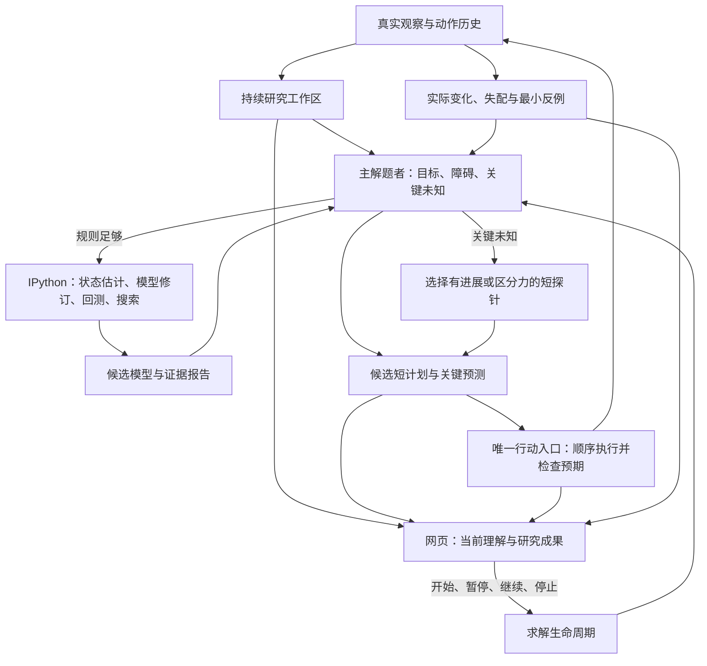

# P7 WorldMap 求解器与网页控制台：整体重设计

> 2026-10-05，用户确认继续实施的整体设计。实现与真实求解验收进行中；本文描述目标合同，不表示能力已验证。

## 1. 产品目标与设计选择

P7 是一个会研究未知游戏并用研究成果解题的智能体。它应从真实交互中形成可修正的 WorldMap，将有用的认识写成可计算的程序，通过推演找到路线，并在真实执行中检验和改进自己的模型。网页控制台让操作者看到这整个过程。

选择 **一个主解题者、一个持续研究工作区、一条预测驱动的行动循环**。复用 Prime 的持久 IPython 编程能力；不要求沿用现有 P7 工具列表、认知账本、类结构、机制 DSL 或搜索器。必要时由主解题者调用专注建模任务，仍保持一个环境动作所有者。

PNG、数字网格或两者结合属于感知选择，不是这次重设计的前提。核心能力是模型能操作真实证据、表达适合游戏的状态和规则、计算目标及路线，并从反例中修正。参考来源与当前实现诊断见 `docs/reviews/2026-10-05-p7-worldmap-solving-design-review.md`。

保留项目级边界：Python 编排；应用调用既有 runtime 与 runner；真实动作只有一个受控入口；观测是证据，程序预测和语言假说不能自行变成真实结果。本文不批准另造通用 composer、runner 或将应用知识写进框架模块。

## 2. 认知架构

### 主解题者

主解题者负责整个游戏目标与行动选择。每次收到反馈后，它回答：当前要完成什么，阻碍是什么，哪些规则足够可信，哪项未知会改变下一步选择，以及下一项计算或真实动作为什么有用。

它可以直接依据部分认知推进，不必先完成全部建模。对确定控制不重复试验；对影响路线的未知条件选择短实验；对已有可用规则调用代码推演、搜索和比较路线。完成一次建模后应实际使用模型，避免建模、记笔记和读工具持续占用循环却不解题。

### 专注建模任务

主解题者可在复杂规则、隐状态、反复失配或搜索困难时调用专注建模任务。它接收固定证据快照、当前目标/竞争假说和具体计算问题，返回候选程序修订、覆盖范围、反例、验证结果及可检验建议。

专注任务不派发真实动作，不直接替换当前模型。主解题者审阅并选择修订；工作区按版本串行接纳，避免两个任务同时修改当前程序或争用 kernel。默认单一 actor 在同一 IPython 中研究即可；增加专注上下文是按需能力，不是每步固定调用。

### 持续研究工作区

研究成果独立于模型聊天窗口存在。工作区保存原始观察、程序与状态、当前 WorldMap、证据摘要、开放问题、尝试反例和计划。工具应让模型直接读、计算、修改这些成果，而不是要求模型把每条认识翻译成一套预设机制表单。

Host 持有只追加的权威动作/观察历史。模型读取快照或副本并写派生结果；模型文件、stdout 和自述不能改写原始证据。控制台及回测都引用同一权威历史序号。

## 3. WorldMap 的含义

WorldMap 是当前可操作的游戏理解，包含以下相互关联的内容：

| 内容 | 用途 |
|---|---|
| 观察到的对象、布局、关系和当前状态 | 确定当下可以做什么 |
| 推断的隐状态和少量竞争解释 | 区分看起来相同、后续行为可能不同的状态 |
| 动作规律、条件、代价和失败风险 | 预测后继并判断路线可行性 |
| 胜利条件与当前子目标 | 判断进展，识别障碍与关键未知 |
| 当前模型的范围、证据与反例 | 判断哪里可演算、哪里需要短探针 |

稳定中文玩法介绍继续是主要可读视图，描述这是什么游戏、对象含义、控制、规则、目标及未知条件。它与程序模型共用版本关联和证据来源，不维护一份脱离计算和反馈的独立“确定真理”。程序模型的存在也不要求每句话都可执行。

置信度、实测支持与适用范围分别表达。一次移动成功只支持该条件下的动作效果，不能确认完整胜利条件、路线正确性或最短性。保留尚未确认但有规划价值的认识；反例能使适用范围缩小或候选模型被替换。

不同关卡共享机制，布局、资源、阶段和局部参数重新估计。RESET 重建当前尝试状态，过关建立下一关状态，进程恢复校准实际观察；三者不能混为“把所有理解清空”或“旧状态完全可续用”。

## 4. IPython 作为研究与规划引擎

### Prime 与 P7 的职责

`asterion-prime` 提供通用持久计算工作区：kernel 执行、串行调度、有限计算、取消、代码/数据工件与显式恢复。P7 经由这一框架能力编程，拥有游戏证据接口、WorldMap、模型/搜索代码、目标与计划；真实环境动作仍由 P7 Broker 唯一执行。通用 Prime 模块不解释游戏规则，不依赖 P7。

当前执行实现位于 P7，实施时提取可复用的计算生命周期，保留应用 bootstrap 与证据适配。现有 compaction 能保留 kernel；完整进程恢复仍需实现显式工件合同，不能宣称任意 namespace 已能恢复。研究 worker 不继承动作 bridge 的文件描述符或凭据，只接只读证据服务；这属于能力路由隔离，不是同 UID 任意 Python 的操作系统沙箱。

模型可选择适合游戏的抽象状态，并逐步实现状态估计、转移、观察投影、目标判断、候选动作、子目标、启发式和专用搜索。状态可以包括开关、库存、计时、选择模式、屏外地形和历史变量，不能限制为整张像素图加关卡号。

这些是可用的编程约定，不是进入求解前必须全部完成的闭合协议。早期只会模拟移动也能搜索一个接近目标或检验碰撞的子目标。不能解释的变量和状态明确为 unknown；代码能保留少量候选模型并比较预测。

研究工作由问题驱动，例如：

- 从历史差分估计一次操作移动了哪些对象，有没有条件依赖。
- 让候选转移解释已观察的动作，找第一个反例并判断漏了状态还是规则错误。
- 对当前模型搜索达到一个子目标的路线，比较动作数与风险。
- 比较两项目标假说在哪个最短探针上预测不同结果。

模型代码、数据、当前状态和验证报告可读且可修订。持久 namespace 减少重复工作，纯程序产物保证聊天压缩或 worker 重建后研究可继续。只恢复纯模型/分析代码、数据和已分析历史序号，不重播含真实动作的 cells；随后用真实当前观察校准。

计算预算由应用设置有限值。长搜索应分块保留 frontier、输出简短进展，而非执行超长 cell 或输出完整空间。超时只说明计算未完成，不说明无解。基础实现可用纯 Python；可用数值库按实际打包环境声明。

## 5. 检验、规划与纠错

### 模型检验分三层

1. **状态与观察投影**：对象是否识别正确，隐状态是否足够，模型声称覆盖的区域能否对应真实观察。
2. **转移规律**：给定该状态和动作，已声称的后继是否符合历史；保留未覆盖部分与最小反例。
3. **目标与终局**：目标谓词是否与真实过关/失败证据一致；没有终局证据时仍是目标假说。

模型动态回测正确不能顺便确认目标；搜索在错误 outcome 下找到路线不能宣布真实游戏可赢。覆盖范围记录适用关卡、状态区域、动作和反例；高验证分数不能掩盖只覆盖很小一部分。

### 两类规划协作

**推进目标**：利用足够可信的规则完成子目标，程序计算路线与关键预测。

**减少关键不确定性**：当未知条件影响路线时，选短探针区分候选规则、目标或隐状态。考虑预期进展、信息收益、动作成本、风险与可恢复性；没有真实计算依据时不显示伪精确的信息增益数字。

搜索进入未覆盖区域应返回“不确定前沿”和所依赖假设，供主解题者决定是否执行短探针。规则不完整不等于只能盲试；已懂的部分继续用于计算。一次普通动作可同时推进目标与检验多个相关假说，不为每条假说强制安排独立实验。

### 预测驱动的行动循环

计划由主解题者明确提交，包含当前起点、模型版本、目标、动作序列、关键预期和未确认条件。分析代码只能产生候选，不能自行 dispatch。

新工具面分为研究计算与独立计划提交。研究 cell 只注入证据读取/计算接口，不携带动作提交凭据；真实行动授权位于主解题者的提交入口，由 Broker 核对。不能只靠 prompt 阻止自由 Python 直接调用动作 API。它仍复用同一 Prime/runtime/kernel 与唯一执行链，不新建 runner。

行动端顺序执行短前缀，每步记录真实结果并检查预期。关键失配、关卡/终局变化、动作不可用或暂停请求使剩余后缀停止。第一次失配反馈给主解题者：预测什么、实际发生什么、哪个模型和状态被使用、哪些后缀未执行。

主解题者定位状态估计、规则、目标或代码错误，保留反例，再修订、回测或选探针。候选模型分支和旧版本可回退，失败修订不覆盖可靠成果。旧模型、旧观察或新关卡不能继续消费原计划。

完整模型证书不是所有探索动作的通行证。现有受认证 DSL 可以作为一个模型实现保留，也可在新设计中移除；它不再限定智能体能表达的全部世界规律。证据检查约束真实计划，不能把合理的假说推演与外部真实引擎搜索得到答案混为一谈。

## 6. 网页控制台是求解过程的共同观察面

控制台与求解器使用同一条事件时间轴和模型版本。它不是另一个求解者，也不由前端猜测后端的推理状态。

### 页面工作区

| 区域 | 默认内容 | 操作者可做什么 |
|---|---|---|
| 游戏画面 | 当前真实帧、对象标注、当前目标位置；模型预测使用独立标识 | 看当前帧、按事件回看、比较预测与实际 |
| 当前求解任务 | 当前目标、障碍、关键未知、下一计算/动作及简短依据 | 判断是否在推进、查看对应证据 |
| WorldMap | 稳定中文玩法介绍、当前状态、关键规则/目标假说、修订摘要 | 查看认识如何改变，按需展开证据范围与反例 |
| 研究与计划 | IPython 任务、回测/搜索摘要、当前模型版本、候选计划及假设 | 看计算是否完成、计划为何可信或需探针 |
| 行动反馈时间轴 | 决策、计算、计划、真实动作、失配和修订的连续链 | 定位导致某项认识改变的动作和观察 |

默认突出当前任务、画面和认识，详细计算与证据渐进展开。长计算显示明确阶段、真实开始时间、可用的已完成工作量和停止入口；没有可计算总量时不制造百分比。认知条目数量不作为进展指标。

候选画面和模拟轨迹始终标为预测，不混入真实帧档案。计划显示哪些已执行、哪些未执行、为何停止。某个假说被推翻时，页面能链接到对应的预测、真实变化和修订版本；这些是公开结果与依据，不展示私有思维链。

### 来源明确的事件

事件覆盖观察、公开决策、计算开始/结束/失败、模型修订、验证报告、候选计划、动作结果、失配和生命周期。每项记录明确关联 run、attempt、level、观察序号、任务/计划标识和模型版本；允许缺失关联，但不补造。

三种内容明确区分：**模型声明**（当前目标/假说）、**计算结果**（指定程序版本的回测/搜索）、**真实观察**（环境动作及返回状态）。计算完成不等于关卡完成，模型自述“确定”不等于实测已证实。

实际计算生命周期来自 operator/IPython 的调用边界。计算类别和目的来自明确声明；不能根据 stdout 猜测“正在搜索”。缺少结束证据显示中断或未知。页面不直接暴露 provider payload、prompt、任意 stdout、私有路径或完整分析代码；需要检视程序时由独立受控研究工件入口处理。

历史回看冻结当时的画面、目标、WorldMap、模型版本、计划和证据，不用最终认识覆盖早期状态。历史视图只读；独立的全局停止入口仍针对当前真实运行。现场、回放和离线导出复用同一投影规则。

### 操作与运行状态

操作者获得开始、暂停、继续、停止和回看。求解工作阶段与进程生命周期分别显示：正在计算不是卡死，已请求停止也不是已清理。

暂停停止新派发，允许已派发动作返回并记录，然后保存一个真实边界。继续先核对当前观察、模型版本和待执行计划；不匹配就重新规划。停止终止运行并确认 owned processes/guest 清理。有限应用控制不因反复暂停或恢复被无限延长。此处定义新设计目标，当前取消功能不能因此改称暂停已实现。

计算中的暂停请求立即阻止新行动，当前有界 cell 完成或主动让出后才进入 paused；此前显示 pause-requested。停止可取消当前计算，并记录 interrupted；不能假定尚未落盘的搜索 frontier 已保存。

人工试玩、存档与回放继续独立。人工动作不进入 P7 的模型证据和经验；本设计不默认授权人工向自主局注入答案或路线。未来若加入人工建议或接管，应单独标来源并使相关旧计划失效，同时与自主能力评估隔离。

## 7. 对当前实现的处置

不以兼容现有类和工具为设计目标。实现时依据职责决定保留、重写或删除：

- 复用已有 Prime/IPython 的执行能力，以及真实动作、身份和历史证据边界。
- 用持续研究工作区与统一求解状态替换分散、反复注入的知识协调流程。
- 将模型自由编程、历史回测、目标与路线搜索提升为默认能力，取消其仅为 fallback 的策略定位。
- 重做应用工具面，使自动观察/反馈和少量真正有用的计算/行动入口支撑整条循环；不保留仅服务旧账本操作的工具。
- 将 console 的阶段、模型、计划和纠错事件与新求解循环共同设计；已有实时展示与 HUMAN 资产按契合度复用。
- 受限 DSL、自动归纳和现有 stores 若保留，只作为明确的模型/证据实现，不能继续决定所有游戏的表达范围。

用户确认继续后，`D-2026-10-05-01` 修订了 `D-2026-10-01-01` 的 DSL-only planner 选择；实际代码迁移由实施计划跟踪。保留的原则是当前证据、预测检查与唯一真实动作入口，而非有限规则表本身。

## 8. 整体验收与实施范围

验收是连续的自主求解故事：未知游戏 → 形成工作模型 → 用证据修正 → 程序计算路线 → 实际兑现预测 → 遇到反例继续求解。控制台必须能复原同一故事。

首个能力检查使用全新本地游戏和固定应用预设，不载入精确成功路线、不使用人工动作或真实 SDK 离线搜索生成答案。保留全部动作、RESET、时间与停止原因。记录模型程序如何改变下一动作，而非只统计调用次数。

随后检查下一关机制迁移，以及复用认识/程序而不复用精确动作路线的再次求解。真实胜利状态和动作效率是结果；语言描述、回测、synthetic tests 和 UI 检查只是各自边界内的证据。

实现作为一个共同验收的重构包：求解控制循环、研究工作区、模型计算与证据、动作反馈、控制台事件及交互同时闭合。开发可按依赖分工，但不能只交付工具、prompt 或页面片段便宣称完成。

工具变更须同时更新 TypeScript 注册、打包扩展、Python bridge、allowlist、prompt 与针对性测试；跑扩展/Python/打包检查，再走有限真实 wheel 运行并记录结果。全仓既有失败单独标注，不能隐去，也不能让无关门禁代替求解验收。

本设计来自源码比较与用户目标，尚未被新的真实求解评估证明。它允许整体替换实现，但不构成 25 游戏全量复现或无限模型运行的授权。

## 9. 首次实测后的主路径补充合同

首次 fresh SP80 L1 的真实通关证明了行动闭环，但该次运行没有 IPython 计算或 WorldMap 发布，不能证明持久模型参与了行动选择。因此把语言 WorldMap 修订变成低成本的主路径，不用强制无用计算补齐调用次数。

在同一个 `p7_workspace` 增加 `revise`：直接提交当前语言 WorldMap、任务、证据和修正，生成不可变子版本。它继承程序源码、状态与报告的原证据含义，不运行代码、不接纳自报验证结果、不赋予模型声明环境事实地位。程序建模与计算产物继续使用现有 `publish` 路径。

初始真实计划必须引用具有非空游戏描述和当前目标的语义版本，并关联当前真实观察；未知规则、未知目标细节和竞争假说都允许，不要求完整模型、程序或认证。初始 probe 没有特殊绕过入口，因为直接 `revise` 已足够轻量。匹配成功的计划可以继续复用版本；预测失配、实际 RESET 或过关换图后，下一段计划前必须完成一次关联当前证据的修订。一次修订可处理多项认识，不逐动作或逐假说强制实验。

语义修订门槛与 kernel 恢复校准分别记录。同一次有效修订可以满足两者，但必须是实际可用的 kernel，且修订不能使真实 `kernel.lost` 或环境结果 unknown 变为正常。环境结果 unknown 仍禁止再派行动；恢复计算工作区不能恢复未知的环境动作。

因果关系沿用计划的 `workspace_revision`、`goal`、`assumptions` 和版本的证据、修正及真实反馈，不增加另一套 basis 标识或调度循环。验收观察认识怎样影响计划、遇到反例怎样修订及跨关怎样复用；修订次数和 IPython 调用次数均不是求解能力证明。
